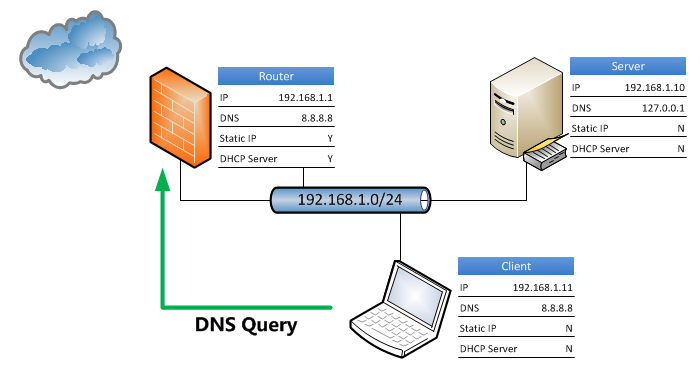
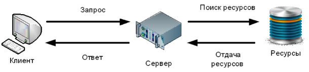
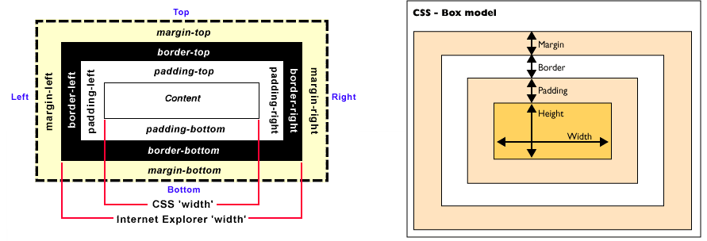
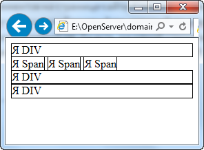
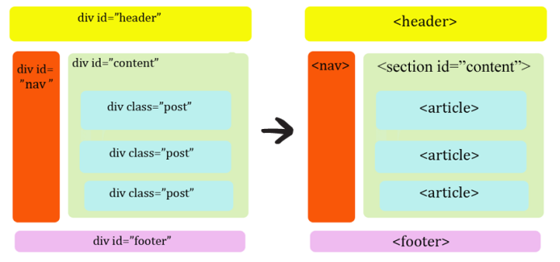
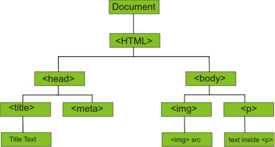
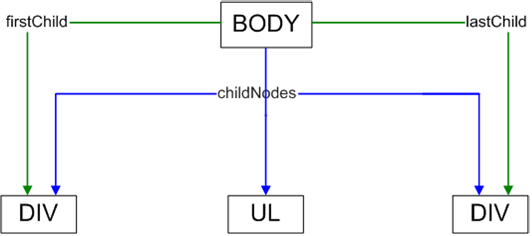
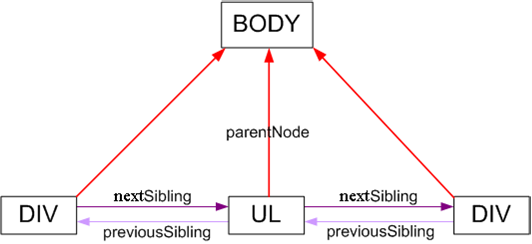

# Шестой поток Python

# Оглавление

1. [Модуль №1. Управление созданием экземпляров класса](#module01)
2. [Модуль №2. Приемы объектно-ориентированного программирования](#module02)
3. [Модуль №3. Python Deployment](#module03)
4. [Модуль №4. Многопоточность в Python](#module04)
5. [Модуль №5. Процессы в Python](#module05)
6. [Модуль №6. Асинхронное программирование](#module06)
7. [Модуль №7. Основы Web](#module07)

## Модуль №1. Управление созданием экземпляров класса <a name="module01"></a>

### Занятие m01_01 (06.07.2022)

> Рассмотрели создание метаклассов. Абстрактные базовые классы. Рассмотрены методы `exec`, `eval` и
> пример `ast`

Вызов встроенного класса `type()` может использоваться в качестве динамического эквивалента объявления класса. Ниже
приведен пример определения класса с вызовом `type()`:

```python
def method(self):
    return 1


MyClass = type('MyClass', (object,), {'method': method})
```

Это эквивалентно явному определению класса с ключевым словом `class`:

```python
class MyClass:
    def method(self):
        return 1
```

Каждый класс, который явно создается таким образом, имеет метакласс `type`. Такое поведение по умолчанию можно изменить,
добавив именованный аргумент `metaclass`:

```python
class ClassWithAMetaclass(metaclass=type):
    pass
```

Значение, предоставляемое в качестве аргумента `metaclass`, — это, как правило, еще один объект класса, но может быть
любым другим вызываемым объектом, который принимает те же аргументы, что и класс `type`, и возвращает другой объект
класса. Сигнатура вызова такова: `type(name, bases, namespace)`. Значение аргументов выглядит следующим образом:

- `name` — имя класса, которое будет храниться в атрибуте `__name__`;
- `bases` — список родительских классов, которые станут атрибутом `__base__` и будут использоваться для построения ПРМ
  вновь созданного класса;
- `namespace` — пространство имен (отображение) с определениями для тела клас- са, который станет атрибутом `__dict__`.

Метаклассы — это своего рода метод `__new__()`, но на более высоком уровне определения класса. Несмотря на то что вместо
метаклассов можно добавить функции, которые явно вызывают `type()`, обычно для этого используется другой класс,
наследующий от `type`. Общий шаблон для метакласса выглядит следующим образом:

```python
class Metaclass(type):
    def __new__(mcs, name, bases, namespace):
        return super().__new__(mcs, name, bases, namespace)

    @classmethod
    def __prepare__(mcs, name, bases, **kwargs):
        return super().__prepare__(name, bases, **kwargs)

    def __init__(cls, name, bases, namespace, **kwargs):
        super().__init__(name, bases, namespace)

    def __call__(cls, *args, **kwargs):
        return super().__call__(*args, **kwargs)
```

Аргументы `name, bases, namespace` имеют такое же значение, как и в `type()`, но все эти четыре метода могут иметь
различные цели.

- Метод `__new__(mcs, name, bases, namespace)` отвечает за фактическое создание объекта класса, как и у обычных классов.
  Первый аргумент является объектом метакласса. В предыдущем примере это был бы просто Metaclass. Обратите внимание,
  что `mcs` — общепринятое имя для данного аргумента.
- Метод `__prepare__(mcs, name, bases, **kwargs)` создает пустой объект про- странства имен. По умолчанию возвращает
  пустой `dict`, но может возвращать и любой другой тип отображения. Обратите внимание: он не принимает `namespace` в
  качестве аргумента, поскольку до вызова пространство имен еще не существует.
- Метод `__init__(cls, name, bases, namespace, **kwargs)` не особо популярен в реализации метакласса, но имеет тот же
  смысл, что и в обычных классах. Он может выполнять дополнительную инициализацию объекта класса, как только тот будет
  создан с помощью `__new__()`. Первый позиционный аргумент теперь называется `cls` и обозначает уже созданный объект
  класса (экземпляр метакласса), а не объект метакласса. В момент вызова `__init__()` класс уже был создан, и поэтому
  данный метод не так полезен, как `__new__()`. Реализация такого метода очень похожа на использование декораторов
  класса, но основное отличие состоит в том, что `__init__()` будет вызываться для каждого подкласса, а вот декораторы
  класса для подклассов не вызываются.
- Метод `__call__(cls, *arg, **kwargs)` вызывается, когда вызывается экземпляр метакласса. Последний является объектом
  класса, он вызывается при создании новых экземпляров класса. Метод позволяет переопределить способ создания и
  инициализации экземпляров класса.
-

Методы `exec`, `eval` и `ast`

- `exec(object, global, locals)` — позволяет динамически выполнять код Python. Элемент `object` должен быть строкой или
  объектом кода (см. функцию `compile()`), представляющим один оператор или последовательность нескольких.
  Аргументы `global` и `local` — это глобальные и локальные пространства имен для исполняемого кода, которые не являются
  обязательными. Если они не указаны, то код выполняется в текущем пространстве. Если указаны, то `global` должен быть
  словарем, а `local` может быть любым объектом отображения, он всегда возвращает `None`.

- `eval(expression, global, locals)` — используется для вычисления данного выражения и возвращает его значение. Похоже
  на `exec()`, но `expression` — это всего одно выражение Python, а не последовательность операторов. Возвращает
  значение вычисленного выражения.

- `compile(source, filename, mode)` — компилирует источник в объект кода или AST. Исходный код предоставляется в
  качестве строкового значения в аргументе `source`. `filename` — это файл, из которого читается код. Если связанного
  файла нет (например, потому что он был создан динамически), обычно используется значение `<string>`.

Режим

- `exec` (последовательность операторов),
- `eval` (одно выражение) или `single` (один интерактивный оператор, например, в интерактивной сессии Python).

### Занятие m01_02  (08.07.2022)

- `ex01` - `ex02` Правильный подход к декорированию
- `ex02` - `ex05`, `my_logger` - Принципы логирования
- `ex06` - Ведение логирования к функции: `level` - это уровень, `name` — это имя регистратора, а message — это
  сообщение журнала. Если имя и сообщение не указаны,
  по умолчанию они соответствуют модулю и имени функции.
- `ex07` - модификация примера `ex06`
- `ex08` - Написание декораторов, которые добавляют аргументы обернутым функциям
- `ex09` - Определение декораторов как классов
- `ex10` - `ex12` - Пример упрощения класса `Person` с помощью макроподстановки

## Модуль №2. Приемы объектно-ориентированного программирования  <a name="module02"></a>

### Занятие m02_01 (13.07.2022)

Рассмотрели **SOLID**

### Занятие m02_02 (15.07.2022)

Рассмотрели основные паттерны проектирования

## Модуль №3. Python Deployment <a name="module03"></a>

### Занятие m03_01 (20.07.2022) Pipenv, Poetry

Создание UI приложения

Tkinter (від англ. Tk interface) — багатоплатформна графічна бібліотека інтерфейсів на основі засобів Tk (широко
розповсюджена у світі GNU/Linux та інших UNIX подібних систем, портована в тому числі і на Microsoft Windows, Apple Mac
OS), поширювана з відкритими вихідними текстами, написана Стіном Лумхольтом (Steen Lumholt) і Гвідо ван Россумом.
Входить у стандартну бібліотеку Python.

Команда создания десктоп приложения для `app_pipenv`:

```shell
pipenv run pyinstaller -F --icon=alisa.ico --noconsole main.py
```

[Игра сапер на Tkinter](https://www.youtube.com/watch?v=I4yl0VbXpA8&list=PLQAt0m1f9OHtfXxDph-MJvYCLaOvildGQ)

[Poetry](https://python-poetry.org/docs/basic-usage/) - это инструмент для управления зависимостями в Python проектах (
аналог встроенного pip).

[Poetry видео](https://www.youtube.com/watch?v=KOC0Gbo_0HY)

Облачный сервис [Replit](https://replit.com)

[Docker Desktop](https://www.docker.com/products/docker-desktop/)

### Занятие m03_02 (22.07.2022) Docker

Скачать с DockerHUB образ и запустить контейнер с БД MongoDB последней версии. Флаг `-d` используем, чтобы не заходить
внутрь контейнера и запускаем его в режиме `demon`

```shell
docker run -d mongo
```

Если хотим запустить контейнер и сразу зайти в него, то выполняем команду

```shell
docker run -it mongo
```

Если контейнер уже работает с флагом `-d` то зайти в него можно командой, главное указать его `id hash`

```shell
docker exec -it <hash>
```

Посмотреть на запущенные контейнеры можно командой. Если добавить флаг `-a` увидим еще и не запущенные контейнеры

```shell
docker ps -a
```

Остановить выполнение контейнера можно командой `stop`, после надо указать или имя контейнера, или его `hash` (можно
ввести первые цифры `hash`, главное чтобы докер однозначно понял, что надо остановить)

```shell
docker stop <name|hash>
```

Повторный запуск команда `start`

```shell
docker start <name|hash>
```

Удаление контейнера

```shell
docker rm <name|hash>
```

Чтобы контейнер был нам "полезен" необходимо пробросить порты наружу. Слева это наш порт `27017:27017`, который будет
виден на компьютере для нашей программы. Справа порт который использует контейнер внутри себя. Левый можем указывать при
запуске любой, главное, чтобы он был свободен в системе.

```shell
docker run -p 27017:27017 -d mongo
```

Для того чтобы вывести сохранение данных БД снаружи контейнера можно использовать `voluemes`. Это позволяет хранить
данные не внутри контейнера, а локально на диске в папке `e/dbstorage`.

```shell
docker run -p 27017:27017 -v e/dbstorage:/data/db -d mongo
```

Создать образ из **Dockerfile**. Точка это путь, где находится файл **Dockerfile**

```shell
docker build . -t nickname/name-image
```

Запустить сборку из `docker-compose.yml` файла внутри папки с файлом

```shell
docker-compose up -d
```

## Модуль №4. Многопоточность в Python <a name="module04"></a>

### Занятие m04_01 (27.07.2022)

План урока в названии файлов.

Рассмотрели:

- Создание потоков в Python. `Thread`, `Timer` (01-04)
- Контроль доступа к ресурсам. `Rlock` (05)
- Синхронизация потоков. `Event`, `Condition`, `Semaphore`, `Barrier` (06-11)

### Занятие m04_02 (29.07.2022)

**Приложение** `Task runner`

С помощью потоков собираем (конкатенируем) файлы `js` в один файл `main.js`

**Приложение** `exchangeRate`
Рассмотрели последовательный подход правильного **HTTP** запроса.

2. Вариант реализации через `Queue` - `main_thread_final.py`
3. Вариант реализации через `ThreadPoolExecutor` - `app.py`

Статья [Использование ThreadPoolExecutor в Python 3](https://www.digitalocean.com/community/tutorials/how-to-use-threadpoolexecutor-in-python-3-ru)

## Модуль №5. Процессы в Python <a name="module05"></a>

### Занятие m05_01 (04.08.2022)

### Занятие m05_02 (05.08.2022)

Очень хорошая статья про использование `Pipe` с
процессами [Multiprocessing Pipe in Python](https://superfastpython.com/multiprocessing-pipe-in-python/)

Статья про использование логирования внутри
процессов [Multiprocessing Logging in Python](https://superfastpython.com/multiprocessing-logging-in-python/)

## Модуль №6. Асинхронное программирование <a name="module06"></a>

### Занятие m06_01 (10.08.2022)

### Занятие m06_02 (12.08.2022)

[RuntimeError: Event Loop is Closed asyncio Fix](https://pythonalgos.com/runtimeerror-event-loop-is-closed-asyncio-fix/)

[Асинхронный python без головной боли (часть 1)](https://habr.com/ru/post/667630/)

[Группы асинхронных задач в Python 3.11](https://habr.com/ru/company/otus/blog/681560/)

## Модуль №7. Основы Web <a name="module07"></a>

### Занятие m07_01 (17.08.2022)

#### Как устроен интернет

##### Основные понятия

**Хостинг** — услуга по предоставлению вычислительных мощностей для размещения информации на сервере, постоянно
находящемся
в сети. Хостингом также называется услуга по размещению оборудования клиента на территории провайдера с обеспечением
подключения его к каналам связи с высокой пропускной способностью. Обычно хостинг входит в пакет по обслуживанию сайта и
подразумевает как минимум услугу размещения файлов сайта на сервере, на котором запущено ПО, необходимое для обработки
запросов к этим файлам (веб-сервер). Как правило, в обслуживание уже входит предоставление места для почтовой
корреспонденции, баз данных, DNS, файлового хранилища на специально выделенном файл-сервере и т.п., а также поддержка
функционирования соответствующих сервисов.

**Сервер DNS** — программно-аппаратный комплекс, обеспечивающий трансляцию доменных имен в сетевые адреса (IP-адреса).



**Координатор** — уполномоченное юридическое лицо, осуществляющее управление доменами `.ua`.

**Доменное имя** — символьное обозначение, предназначенное для сетевой адресации, в которой используется система
доменных
имен.

**Стоп-лист** — перечень символьных обозначений, регистрация которых в качестве доменных имен недоступна.

**Регистратор** — юридическое лицо, аккредитованное Координатором для регистрации доменных имен в доменах `.ua`

##### Общие сведения

Сервер и браузер общаются, посылая друг другу запросы по особому протоколу – HTTP (RFC-2616). Соединение может
инициировать только браузер. Он посылает серверу запрос — показать такой-то файл.



**HTTP** является синхронным протоколом. Это значит, что клиент послал запрос серверу и пока ждет от него ответ,
следующие
запросы послать не может. Также следует отметить, что **HTTP** — протокол без состояния. Т.е. сервер не сохраняет
информацию
о пользователе между запросами. Для сохранения состояния пользователя в системе используется механизм **cookie** или
сессий.

**Запрос происходит в несколько этапов**:

- *DNS-запрос* — поиск ближайшего DNS-сервера, чтобы преобразовать URI (например, `google.com`) в его числовое
  представление — IP-адрес (`74.125.87.99`, прим. — получено посредством команды `ping`). Это адрес и будет реальным
  адресом сайта в Интернет.
- *соединение* — установка соединения с сервером по полученному IP-адресу;
- *отправка данных*;
- *ожидание ответа* — в этот момент ждем пока пакеты данных дойдут до сервера, он их обработает и ответ вернется назад;
- *получение данных*.

Если какой-то элемент веб страницы размещен на другом хосте, для запроса этого элемента устанавливается новое
соединение, начиная с DNS-запроса.

**Пакеты данных в запросах и ответах между клиентом и сервером содержат HTTP-заголовки. Рассмотрим пример заголовков
запроса:**

```http request
GET /other-19 HTTP/1.1
Host: www.example.com
User-Agent: Mozilla/5.0 (Windows; U; Windows NT 6.0; ru; rv:1.9.1.5) Gecko/20091102 Firefox/3.5.5 (.NET CLR 3.5.30729)
Accept: text/html,application/xhtml+xml,application/xml;q=0.9,*/*;q=0.8
Accept-Language: ru,en-us;q=0.7,en;q=0.3
Accept-Encoding: gzip,deflate
Accept-Charset: windows-1251,utf-8;q=0.7,*;q=0.7
Keep-Alive: 300
Connection: keep-alive
```

В первой строке передается информация о методе передачи данных (в данном случае `GET`), затем идет информация о том на
какой ресурс они передаются, который необходимо вернуть `/other-19`, и в конце версия протокола `HTTP/1.1`. На следующее
строке передается информация о хосте, на который передается запрос. Далее в параметре `User-Agent` клиент передает
информацию о браузере. Затем в параметрах `Accept`, `Accept-Language`, `Accept-Encoding`, `Accept-Charset` передается
информация о кодировке, с которой работает браузер, язык по умолчанию для браузера и метод сжатия информации. В конце,
в параметре `Connection`, следует сообщение серверу, что надо открыть постоянное соединение, а в параметре `Keep-Alive`
указываем на сколько (в секундах) мы открываем соединение с сервером.

В свою очередь сервер может отправить ответ со следующими заголовками:

```http request
HTTP/1.1 200 Ok
Server: nginx
Date: Mon, 29 Sep 2014 12:04:19 GMT
Content-Type: text/html; charset=UTF-8
Connection: close
Cache-Control: no-cache,no-store,max-age=0,must-revalidate
Expires: Mon, 29 Sep 2014 12:04:19 GMT
Last-Modified: Mon, 29 Sep 2014 12:04:19 GMT
Content-Encoding: gzip
``` 

**Ответ сервера состоит из следующих настроек**:

1. В первой строке сервер отдает информацию о версии `HTTP` протокола, статус и описание ответа (все используемые
   статусы
   ответов сервера приведены
   в [здесь](https://ru.wikipedia.org/wiki/%D0%A1%D0%BF%D0%B8%D1%81%D0%BE%D0%BA_%D0%BA%D0%BE%D0%B4%D0%BE%D0%B2_%D1%81%D0%BE%D1%81%D1%82%D0%BE%D1%8F%D0%BD%D0%B8%D1%8F_HTTP)
   .
2. Параметр `Server` говорит о типе сервера.
3. Параметр `Content-Type` – типа отдаваемого содержимого.
4. Параметры `Cache-Control`, `Expires`, `Last-Modified` – отвечают за кэширование ответа сервера.

**Коды состояния ответов сервера**

Часть первой строки ответа сервера при запросах по протоколу `HTTP`. Он представляет собой целое число из трёх
десятичных
цифр. Первая цифра указывает на класс состояния. За кодом ответа обычно следует отделённая пробелом поясняющая фраза на
английском языке, которая разъясняет человеку причину именно такого ответа. Посмотреть, что они значат
можно [здесь](https://ru.wikipedia.org/wiki/%D0%A1%D0%BF%D0%B8%D1%81%D0%BE%D0%BA_%D0%BA%D0%BE%D0%B4%D0%BE%D0%B2_%D1%81%D0%BE%D1%81%D1%82%D0%BE%D1%8F%D0%BD%D0%B8%D1%8F_HTTP)
.

#### HTML

##### Структура документа

**HTML** расшифровывается HyperText Markup Language (в переводе означает Язык Разметки ГиперТекста).

**HTML** - документ по сути есть обычный текстовой файл, который содержит нормально читаемый текст и специальные команды
разметки (tags или теги), заключенные в угловые скобки `<` и `>`. Теги языка HTML задают правила, по которым браузер
выводит документ на экран: размещение текста в окне, представление графических объектов (рисунков и картинок), а также
вывод звуковых, видео клипов и т. д. HTML тэги обычно используются в паре, например: `<b></b>`. Первый тэг называется
начальным тэгом, а второй конечным тэгом.

Текст находящийся между начальным и конечным тэгом подвергается "разметке". Например `<b>Привет</b>` будет отображено
браузером как **Привет** (слово 'Привет' написанное жирным шрифтом).

Следует иметь в виду, что не все теги совместимы с браузерами. Если браузер не понимает тег, то он его просто
пропускает.

Простейший документ HTML - страница это следующая структура:

```html
<!DOCTYPE html >
<html>
<head>
    <title>
        Название
    </title>
</head>
<body>
Текст страницы
</body>
</html>
```

Файл: index.html

Все **HTML5** документы должны начинаться с объявления `DOCTYPE`.

Предыдущие версии HTML имели несколько типов `DOCTYPE`. **HTML5** имеет только один:

```html
<!DOCTYPE html>
```

Данное объявление переводит все браузеры в нормальный режим. Браузеры не поддерживающие HTML5 в данном режиме будут
интерпретировать старые теги и игнорировать новые, которые они не поддерживают.

Тег `<html>` является контейнером, который заключает в себе всё содержимое веб-страницы, включая теги `<head>`
и `<body>`.

Тег `<head>` предназначен для хранения других элементов, цель которых — помочь браузеру в работе с данными. Также внутри
контейнера `<head>` находятся метатеги, которые используются для хранения информации, предназначенной для браузеров и
поисковых систем. Например, механизмы поисковых систем обращаются к метатегам для получения описания сайта, ключевых
слов и других данных.

Элементы, располагающиеся в секции head не отображаются явно на странице и используются для служебных функций.
В секции head могут располагаться скрипты, инструкции об оформлении страницы и различная мета информация о данном **
HTML**
документе.

Метаданные - это информация о данных находящихся в **HTML** документе. Пример метаданных: кодировка страницы, краткое
описание содержимого, ключевые слова, имя автора, дата последней модификации.

Метаданные не отображаются явно на странице, но используются браузерами и поисковыми системами.

В **HTML** метаданные **HTML** документов определяются с помощью тэга `<meta>`. Тэг `<meta>` всегда должен располагаться
в секции `head`.

Для того чтобы указать браузеру пользователя, какая кодировка используется на данной странице необходимо использовать
атрибут `charset` тэга `meta` например так `<meta charset="UTF-8">`.

Если явно не указать кодировку браузер при отображении страницы будет определять ее автоматически. Если кодировка при
этом будет определена неверно пользователь увидит страницу, содержащую бессмысленные символы, поэтому кодировка
обязательно должна указываться к каждому **HTML** документу.

Любой HTML документ имеет название, заключенное между тегами `<title>` и `</titIe>`. По названию документа HTML браузеры
могут найти информацию, поэтому место для названия всегда определено - оно находится вверху экрана и отдельно от
содержимого документа. Максимальная длина названия - 40 символов. Пустой заголовок, не содержащий ни одного символа,
включая пробел, не допустим. Также запрещено включать в код два и более элемента `<title>`, он должен быть только один.

Элемент `title`:

- Определяет заголовок окна браузера;
- Используется как заголовок страницы в результатах выдачи поисковых систем;
- Используется как заголовок страницы при добавлении сайта в избранное.

Тег `<body>` предназначен для хранения содержания веб-страницы, отображаемого в окне браузера. Информацию, которую
следует выводить в документе, следует располагать именно внутри контейнера `<body>`. К такой информации относится текст,
изображения, таблицы, списки и др. элементы HTML элементом называется комбинация начального тэга, конечного тэга и
содержимого. Пример HTML элемента:

```html
<p> Это абзац. </p>
```

Большинство элементов могут быть вложены друг в друга (т.е. в содержимом одного элементе может
располагаться другой элемент).

HTML не чувствителен к регистру это значит, что тэг `<b>` будет интерпретироваться браузером так же как и тэг `<B>`.

Несмотря на то, что HTML не настаивает на строгом синтаксисе рекомендую заранее выработать определенные правила
написания кода (например если Вы пишете тэги в нижней раскладке, то делайте так всегда).

HTML элементы могут иметь атрибуты. Атрибуты задаются в начальном тэге элементов и состоят из имени и значения, например
в атрибуте `href="https://goit.ua/"` `href` является именем, а `https://goit.ua/` значением.

##### Текстовые абзацы

Изучим основные теги для логической разметки текста. Использовать их можно только внутри тега `<body>`.
Начнём с простейшего тега `<p>`, с помощью которого создаются абзацы. По умолчанию абзацы начинаются с новой строки и
имеют вертикальные отступы, которыми можно управлять с помощью стилей.

```html
<p> Я текстовый абзац </p>
```

Для выделения текста в HTML документах могут быть использованы следующие теги: с помощью тега `<b>`, `</b>` можно
установить
жирный шрифт, тег `<i>`, `</i>` устанавливает наклонный шрифт, но лучше для оформления всегда использовать таблицы
стилей CSS.

Допускается также использование в тексте верхних и нижних индексов соответственно с помощью тегов `<sup>`, `</sup>`
и `<sub>`, `</sub>`.

С помощью HTML тэга `<pre>` Вы можете отобразить предформатированный текст. Все что находится внутри тэга `<pre>` будет
отображено точно так как написано. Браузер не будет удалять идущие подряд пробелы и символы перевода строки.

Установка цветов в HTML документе производится с использованием таблицы стилей **CSS**.

Выбор цвета можно производить разными способами: например заданием имени или определением **RGB** номера выбранного
цвета.
Поддерживаются следующие имена цветов: `AQUA, BLACK, BLUE, FUCHSIA, GRAY, GREEN, LIME, MAROON, NAVY, OLIVE, PURPLE, RED,
SILVER, TEAL, WHITE, YELLOW`.

Номер цвета RGB задается тремя двухзначными шестнадцатеричными числами, причем каждое число из интервала `00 — FF` и
определяет интенсивность соответствующего цвета. Например, номер цвета `#FF0000` соответствует красному цвету, так как
имеет максимальную интенсивность для красного, а зеленый и голубой имеют значения, равные нулю. Соответственно, номер
`#00FF00` кодирует зеленый цвет и номер `#0000FF` - голубой.

В HTML5 появился новый тег `<mark>`, который обозначает выделенный текст. Иногда при работе с объёмными текстами мы
используем маркер, чтобы выделять ключевые слова, идеи или что-то другое, на что стоит обратить внимание. Такое же
назначение и у тега `<mark>`. В современных браузерах текст внутри `<mark>` подсвечивается жёлтым фоном.

##### Заголовки и подзаголовки

Для создания структуры больших текстов обычно используются заголовки. В текстовых редакторах есть возможность выделить
часть текста, найти пункт «Заголовок» нужного уровня в меню, и применить его.

Прежде чем остаться на странице и приступить к ее прочтению пользователи обычно бегло пробегают глазами по ее
содержимому проверяя содержит ли она интересующую их информацию. Обычно заголовки это первое (и часто единственное) на
что они обращают внимание, поэтому неправильное использование заголовков может привести к потере посетителей.
В первую очередь заголовки должны кратко и точно описывать содержимое которое они озаглавливают. Наиболее важная
информация страницы должна располагаться под заголовками большего размера, а наименее важная под заголовками меньшего
размера.

В языке HTML для выделения заголовков предусмотрено целое семейство тегов: от `<h1>` до `<h6>`. Тег `<h1>` обозначает
самый важный заголовок (заголовок верхнего уровня), а тег `<h6>` обозначает подзаголовок самого нижнего уровня.
На практике редко встречаются тексты, в которых встречаются подзаголовки ниже третьего уровня. Поэтому самыми часто
используемыми тегами заголовков являются: `<h1>`, `<h2>` и `<h3>`.

Стоит отметить, что поисковые системы придают особое значение заголовкам, поэтому необходимо учиться правильно их
использовать.

##### Ссылки

Важнейшим свойством HTML являются ссылки, позволяющие связать текст или картинку с другими гипертекстовыми документами.
Текст, как правило, выделяется цветом и оформляется подчеркиванием, для чего используется тэг `<а>`, структура
которого следующая:

```html
<a href=”filename”>текст_ссылки</a>
```

Здесь `filename` — имя файла или адрес Internet, на который необходимо сослаться, а текст_ссылки — текст гипертекстовой
ссылки, который будет непосредственно показан в HTML доку менте. Например, гипертекстовая ссылка

```html

<а href=”my_work.html”>Views</a>
```

ссылается на документ `my_work.html`, образуя гипертекстовую ссылку в виде слова `Views`. Если документ, формирующий
ссылку, находится в другой папке, относящейся к web - сайту, то подобная ссылка называется относительной. Например:

```html

<а href=”photo/my_photo.html”>Moй фотоальбом</а>
```

ссылается на файл `my_photo.html`, расположенный в папке `photo`, вложенной в текущую, и образует ссылку в виде текста
`Мой фотоальбом`. Если есть необходимость сослаться на ресурс Internet, расположенный на удаленном сервере, или указать
в
ссылке полное имя файла и путь к файлу, то используют абсолютные ссылки. Структура такого тега аналогична, только он
формируется на основе полного пути к ресурсу в виде `протокол:/URL/путь`. Например:

```html

<а href=”https://www.google.com”>Поиск в интернет</а>
```

В HTML делят гиперссылки так же на два вида:

- Внешние гиперссылки перемещают пользователя нажавшего на них на другой HTML документ. Это те, которые мы рассмотрели
  выше.
- Внутренние гиперссылки (якоря) перемещают пользователя на предварительно созданную закладку в документе, в котором они
  определены.

```html
<!-- Создание гиперссылки на закладку -->
<a href="#bookmark"> Текст ссылки </a>
<!-- Создание закладки -->
<div id="bookmark"> Текст закладки.</div>
```

##### Изображение

В документах HTML могут использоваться изображения и графика, для чего используется тег ``. Допускается
использование файлов в формате PNG, GIF или JPG/JPEG. Следующий пример демонстрирует вставку в документ JPG файла:

```html

```

Здесь атрибут `src=` определяет **URL** адрес графического файла. В приведенном примере файл будет размещен в области
шириной 45 и высотой 50 пикселей соответственно. Если размеры, указанные атрибутами `height=` (высота) и `width=`
(ширина), не совпадают с размерами графического файла, то последний масштабируется. Рекомендуется для графических файлов
всегда задавать их размеры в таблицах стилей CSS вместо атрибутов `height` и `width`.

Атрибут `alt=` указывает, что именно подставить на место рисунка, если браузер не показывает графические файлы или
вследствие медленной скорости соединения файл еще не получен. Данный атрибут обязателен с точки зрения семантики и
валидатор будет выдавать ошибку.

Картинка может быть средством задания и управления выбором гиперссылок в HTML документе, для чего на тег `img` должна
указывать гиперссылка, определяемая тегом `а`. Например

```html

<а href="index.htm">
    
    </a>
```

##### Списки

Язык HTML имеет возможности для создания различных списков и перечислений. Для их создания могут использоваться
теги `ul`
и `ol`, а элементы списка отмечаются тегом `li`, при этом допускаются вложенные списки любой глубины.
Рассмотрим следующий пример ненумерованного списка и использования тегов `ul` и `li`

```html

<ul>
    <li> красный</li>
    <li> оранжевый</li>
    <li> желтый</li>
    <li> зеленый</li>
    <li> голубой</li>
    <li> синий</li>
    <li> фиолетовый</li>
</ul>
```

Нумерованный список создают, используя теги `ol` и `li` Например список:

```html

<ol>
    <li>элемент первый</li>
    <li>элемент второй</li>
    <li>элемент третий</li>
</ol>
```

По умолчанию нумерация дается арабскими цифрами, начиная с единицы. Используя атрибуты тега `ol`, можно изменить стиль
оформления списка. Атрибут `type=` определяет стиль нумерации (буквы или цифры), при этом допускаются следующие его
значения:

- `type=A` - использовать большие латинские буквы;
- `type=a` - использовать маленькие буквы;
- `type=I` - использовать большие римские цифры;
- `type=i` - использовать маленькие римские цифры;
- `type=1` - использовать арабские цифры

Атрибут `start=` определяет начальное значение списка (десятичное число), например `start=5`.

И наконец, рассмотрим пример вложенного списка, в котором допускается использовать теги `ul`, `ol` и `li`

```html

<ul>
    <li>Первый раздел</li>
    <ul>
        <li>Первый подраздел первого раздела</li>
        <li>Второй подраздел первого раздела
            <ol type="a">
                <li>Первый список</li>
                <li>Второй список</li>
            </ol>
        </li>
        <li>Третий подраздел первого раздела</li>
    </ul>
    <li>Второй раздел</li>
</ul>
```

##### Комментарии

Тег добавляет комментарий в код документа. Текст комментария не отображается на странице. Разрешается внутрь комментария
добавлять другие теги, вложенные комментарии (когда один комментарий расположен внутри другого) недопустимы.

```html
<!-- текст комментария -->
```

С помощью комментариев Вы можете оставлять в коде пояснительные заметки.

- Комментарии полностью игнорируются браузером;
- Комментарии не отображаются при просмотре страницы.

- Комментарии могут использоваться при отладке кода, если Вы не уверены хотите ли видеть данный заголовок, абзац и т.д.
  в
  итоговой версии страницы Вы можете обернуть код в тэг `<!-- -->` на время принятия решения.

##### Спецсимволы HTML

Помимо тегов в языке HTML используется специальный управляющий символ `&` — амперсанд. Этот символ используется для
вывода
специальных символов и символов из расширенной кодовой таблицы, которые нельзя ввести с клавиатуры. Например, вывод
самого символа амперсанд `&` осуществляется посредством последовательности символов `&аmp;` для вывода угловых скобок
используются `&lt;` для `<` и `&gt;` для `>`, а, скажем, символ с номером `182` из кодовой таблицы, может быть задан
последовательностью `&#182;`.

Самый часто используемый спецсимвол - это неразрывный пробел (его мнемоника `&nbsp;`).

Данный символ используется для контролирования переноса строки (после данного символа автоматический перевод строки
невозможен) и для вставки в текст подряд идущих пробелов (по умолчанию если Вы вставите в текст 5 подряд идущих пробелов
браузер вырежет 4 и отобразит лишь один).

Мнемоники и коды часто используемых спецсимволов

| Символ | Описание                         | Мнемоника | Код      |
|--------|----------------------------------|-----------|----------|
|        | Пробел                           | `&nbsp;`  | `&#160;` |
| `<`    | Меньше чем                       | `&lt;`    | `&#60;`  |
| `>`    | Больше чем                       | `&gt;`    | `&#62;`  |
| ©      | Знак авторского права            | `&copy;`  | `&#169;` |
| ®      | Зарегистрированный товарный знак | `&reg;`   | `&#174;` |
| `&`    | Знак амперсанда                  | `&amp;`   | `&#38;`  | 

##### Семантические тэги

Благодаря использованию CSS Вы можете создавать страницы с хорошо понятной для пользователей визуальной структурой, но
будут ли эти страницы также понятны для поисковых систем или браузеров?

Например, как поисковый робот может отличить содержимое документа от навигационного меню если они размечены с помощью
одинаковых div элементов?

Для того, чтобы разрешить эту проблему в HTML5 были введены семантические тэги. С помощью семантических тэгов Вы можете
сделать страницы сайтов более понятными для поисковых систем и браузеров.

- `<footer>` Определяет футер.
- `<header>` Определяет заголовочный блок сайта.
- `<nav>` Определяет навигационное меню.

С помощью тэга `<section>` Вы можете группировать логически связанное содержимого в документе.

Если логически связанное содержимое является автономным (может использоваться в других документах независимо от
остального содержимого на странице) необходимо использовать вместо `<section>` тэг `<article>`.

Тэг `<aside>` используется для выделения элементов, которые не являются частью содержимого, но косвенно с ним связаны.
Данным тэгом могут выделяться: цитаты, дополнительная информация к статье, словарь с терминами, список ссылок и т.д.
Как уже говорилось выше с помощью тэга `<mark>` Вы можете выделить "важную" часть в тексте.

В журналах и газетах иллюстрации часто сопровождаются подписями. В HTML4 невозможно было создавать подписи не прибегая к
использованию CSS.

В HTML5 это проблема решена добавлением новых тэгов: `<figure>` и `<figcaption>`.

```html

<figure>
    
    <figcaption>Мы с Таней на отдыхе, 'Черное море'</figcaption>
</figure>
```

##### Форма

Функциональность сайтов, предоставляющих пользователю возможность ввода данных и получения результатов их обработки,
обеспечивается использованием программ, работающих на стороне сервера — серверных приложений. Эти приложения
обрабатывают полученные от посетителя Web-сайта данные и выдают результат в виде обычной Web-страницы. Именно для них в
HTML предусмотрена возможность создания Web-форм и элементов управления — чтобы посетитель мог ввести данные, которые
потом обработает серверное приложение

Основная схема работы серверного приложения

1. Посетитель вводит в элементы управления, расположенные в Web-форме на Web-странице, нужные данные.
2. Введя данные, посетитель нажимает расположенную в той же Web-форме особую кнопку — кнопку отправки данных (Send, Ok,
   и т.д.).
3. Web-форма кодирует введенные в нее данные и отправляет их серверному приложению, расположенному по-указанному
   URL.
4. Web-сервер перехватывает отправленные данные, запускает серверное приложение и передает данные ему.
5. Серверное приложение обрабатывает полученные данные.
6. Серверное приложение формирует ответ (возможно, это Web-страница) с результатами обработки данных посетителя и
   передает ее Web-серверу.
7. Web-сервер получает сформированную серверным приложением ответ и отправляет ее посетителю.

Форма предназначена для обмена данными между пользователем и сервером. Область применения форм не ограничена отправкой
данных на сервер, с помощью клиентских скриптов можно получить доступ к любому элементу формы, изменять его и применять
по своему усмотрению.

Для создания интерактивных html документов используют заполняемые формы, определяемые тегом `form`. В одном html
документе может быть определено несколько форм для заполнения, но одновременно на сервер может быть отправлена только
одна форма.

По этой причине данные форм должны быть независимы друг от друга и вложенные теги `form` не допускаются. Формат
тега `form` следующий:

```html

<form action="url" method="GET/POST">
    ...
</form>
```

Здесь используются следующие атрибуты:

- `action=url` - URL адрес сервера запросов, куда будет отослано содержание формы после подтверждения, если это поле
  отсутствует, будет использован URL адрес текущего документа.
- `method=GET/POST` - HTTP метод, используемый для посылки содержания заполненной формы на сервер. Возможные варианты
  при этом следующие:
    - `GET` - это метод по умолчанию, который приводит к добавлению содержимого заполненной формы к URL;
    - `POST` - при использовании этого метода содержимое заполненной формы пересылается не как часть URL, а как
      содержимое
      тела запроса.
- `ENCTYPE=` задаёт тип кодирования содержимого заполненной формы. Этот атрибут действует только когда, используется
  метод **POST**.

Когда форма отправляется на сервер, управление данными передаётся программе, заданной атрибутом `action` тега `<form>`.
Предварительно браузер подготавливает информацию в виде пары `"имя=значение"`, где имя определяется атрибутом `name`
тега `<input>`, а значение введено пользователем или установлено в поле формы по умолчанию.

Внутрь контейнера `<form>` помещаются другие теги, при этом сама форма никак не отображается на веб-странице, видны
только
ее элементы и результаты вложенных тегов.

**Теги формы**

Внутри тега `form` могут находиться любые теги, кроме другого тега `form`. Для задания интерфейсных элементов
внутри `form`
используются теги `input`, `select`, `textarea` и другие. Давайте их рассмотрим.

Для того чтобы ввести информацию о пользователе (логин, пароль, дату рождения и т.д.) используют элемент ввода `<input>`
.
Его основной атрибут – `type` – определяет, что мы будем вводить и как.

Тег `input` используется для задания простого элемента ввода, при этом могут быть использованы атрибуты:

- `accept`– устанавливает фильтр на типы файлов, которые вы можете отправить через поле загрузки файлов;
- `alt` – альтернативный текст для кнопки с изображением;
- `autocomplete` –включает или отключает автозаполнение, соответственно принимает значения `on` и `off`;
- `checked` – предварительно активированный переключатель или флажок;
- `disabled` – блокирует доступ и изменение элемента;
- `list` – указывает на список вариантов, которые можно выбирать при вводе текста;
- `max` – максимально допустимое значение для ввода числа или даты;
- `maxlength` –максимально допустимое количество символов разрешенных в тексте;
- `min` - минимально допустимое значение для ввода числа или даты;
- `multiple` – позволяет загрузить несколько файлов одновременно;
- `name` – задает имя поля, предназначено для того, чтобы обработчик формы мог его идентифицировать;
- `pattern` – устанавливает шаблон ввода;
- `placeholder` – выводит подсказывающий текст;
- `readonly` – устанавливает, что поле не может изменяться пользователем;
- `required` – отмечает, что поле является обязательным для заполнения;
- `size` –задает ширину текстового поля;
- `step` – задает шаг приращения для числовых полей;
- `tabindex` – определяет порядок перехода между элементами с помощью клавиши **Tab**;
- `type` – сообщает браузеру, к какому типу относится элемент формы.
- `value` – определяет значение элемента.

Значения предпоследнего атрибута `type` в списке очень обширны и важны, поскольку задают поведение при вводе в `input`

| Значение         | Описание                                                                                     |
|------------------|----------------------------------------------------------------------------------------------|
| `button`         | Кнопка                                                                                       |
| `checkbox`       | Флажки. Позволяют выбрать более одного варианта из предложенных.                             |
| `file`           | Поле для ввода имени файла, который пересылается на сервер.                                  |
| `hidden`         | Скрытое поле. Оно никак не отображается на веб-странице.                                     |
| `image`          | Поле с изображением. При нажатии на рисунок данные формы отправляются на сервер.             |
| `password`       | Обычное текстовое поле, но отличается от него тем, что все символы показываются звездочками. |
| `radio`          | Переключатели. Используются, когда следует выбрать один вариант из нескольких предложенных.  |
| `reset`          | Кнопка для возвращения данных формы в первоначальное значение.                               |
| `submit`         | Кнопка для отправки данных формы на сервер.                                                  |
| `text`           | Текстовое поле. Предназначено для ввода символов с помощью клавиатуры.                       |
| `color`          | Виджет для выбора цвета.                                                                     |
| `date`           | Поле для выбора календарной даты.                                                            |
| `datetime`       | Указание даты и времени.                                                                     |
| `datetime-local` | Указание местной даты и времени.                                                             |
| `email`          | Для адресов электронной почты.                                                               |
| `number`         | Поле ввода чисел. Ввод символов, не являющихся цифрами, приведет к выводу предупреждения.    |
| `range`          | Ползунок для выбора чисел в указанном диапазоне.                                             |
| `search`         | Поле для поиска.                                                                             |
| `tel`            | Поле для телефонных номеров.                                                                 |
| `time`           | Поле для времени.                                                                            |
| `url`            | Поле для веб-адресов.                                                                        |

Очень часто мы сталкиваемся с необходимостью выбора. Например, мы выбираем, согласны ли с лицензионным соглашением, мы
выбираем какие странички отображать в меню соц. сети, приложения…

Когда надо выбрать несколько элементов из многих, используют `checkbox` – поле с
квадратиком, куда устанавливается галочка. Создается такое поле так

```html
<input id="checkbox1" type="checkbox" value="Английский"/> Английский <br/>
```

`value` – значение, которое Вы выбрали. Используется для обработки в скриптах. Рядом с полем пишется то слово, которое
соответствует элементу выбора, и мы хотим отобразить на странице в браузере.

Иногда мы можем выбирать только один элемент из списка предложенных альтернатив. Например, мы выбираем пол:
мужской/женский. Такой выбор нам помогут организовать радиокнопки. Создаются они так:

```html
<input type="radio" name="gender" value="мужской"/> мужской
<input type="radio" name="gender" value="женский"/> женский
```

Обратите внимание, что имена `name` – одинаковые. Это обеспечивает то, что вы сможете выбрать (одновременно) только один
из элементов.

Иногда очень удобно задавать альтернативы в виде выпадающего списка. На некоторых сайтах так организован выбор страны,
вуза, возраста. Задание перечня альтернатив удобно для обработки, так как пользователь правильно введёт данные.
Использование выпадающего списка значительно экономит место на форме.

Тег `select` предназначен для создания списков в форме, при этом внутри разрешена только последовательность
тегов `option`,
за каждым из которых следует некоторое количество простого текста.

Атрибуты тега `select` следующие:

- `name=идентификатор` - символьное имя для элемента `select`, по которому он идентифицируется;
- `size=n` - если значение равно 1 или если этот атрибут опущен, то элемент `select` будет представлен как выпадающее
  меню,
  если `size=2` или более, то элемент будет представлен как окно выбора, а значение будет определять, сколько элементов
  списка будут видны;
- `multiple` - если этот атрибут присутствует, то допускается множественный выбор из списка.

Создать список можно так:

```html
<select id="select1">
    <option>Элемент списка</option>
    ...
</select>
```

где `select` – сам список, `option` – элемент списка.

Можно так же организовать выбор из заданного списка: `datalist`. Это называется альтернатива и ее можно задавать с
помощью списка вариантов. Это выглядит так:
Любимое блюдо

```html
<input type="text" name="team" id="favorite_dish" list="dish_list">
<datalist id="dish_list">
    <option>Борщ</option>
    <option>Суп</option>
    <option>Харчо</option>
    <option>Окрошка</option>
</datalist>
```

Обратите внимание на то, что атрибут `list` элемента `input` и атрибут `id` элемента `<datalist>` содержат одинаковое
значение
`dish_list`. Это их связывает.

Тег `button` создает на веб-странице кнопки и по своему действию напоминает результат, получаемый с помощью
тега `<input>` (с атрибутом `type="button | reset | submit"`). В отличие от этого тега, `<button>` предлагает
расширенные возможности по созданию кнопок. Например, на подобной кнопке можно размещать любые элементы HTML, в том
числе изображения. Используя стили можно определить вид кнопки путём изменения шрифта, цвета фона, размеров и других
параметров.

Теоретически, тег `<button>` должен располагаться внутри формы, устанавливаемой элементом `<form>`. Тем не менее
браузеры не выводят сообщение об ошибке и корректно работают с тегом `<button>`, если он встречается самостоятельно.
Однако, если необходимо результат нажатия на кнопку отправить на сервер, помещать `<button>` в контейнер `<form>`
обязательно.

И, наконец, тег `textarea` может быть использован для расположения многострокового поля ввода с необязательным
содержимым в форме.

Атрибуты тега `textarea` следующие:

- `name=` - символьное имя поля ввода;
- `rows=` - число строк в поле ввода, то есть высота поля;
- `cols=` - число столбцов в поле ввода, то есть ширина поля.

Объект `textarea` имеет полосы прокрутки, так что может быть введено любое количество текста. Содержание по умолчанию
должно быть строгим **ASCII** текстом, при этом символы перевода строки воспринимаются.

Пример несложной формы

```html

<form method="POST" name="student" action='/students'>
    <label for="firstname"> Введите Ваше имя
        </br>
        <input type="text" id="firstname" name="firstname" size="45"/>
    </label>
    </br></br>
    <input type="radio" checked name="job"/> <span>Учащийся ВУЗа</span>
    </br>
    <input type="radio" name="job"/> <span>Другое</span>
    </br></br>
    <button type="submit"> Submit</button>
    <button type="reset"> Reset</button>
</form>
```

> Примечание: `</br>` тег перевода строки

#### Верстка

##### Блочные и строчные элементы в CSS

**Блок** — это обычная прямоугольная область, обладающая рядом свойств, таких как: рамка, поля и отступы. Содержимым
блока,
может быть что угодно: кусок текста, картинка, видео-ролик, список, форма для заполнения, меню навигации и т.п.

**Рамка (border)** — это контур, для которого можно задать такие характеристики как толщина, цвет и тип (пунктирная,
сплошная, точечная). В отличие от таблиц вещь необязательная.

**Поля (padding)** — отделяют содержимое блока от его рамки, чтобы текст, например, не лепился тесно к стенкам блока.

**Отступы (margin)** — это пустое пространство между различными блоками, либо между блоком и стенками страницы сайта.
Они
позволяют расположить блоки на заданном расстоянии относительно друг друга.



**Тэг div**

В отличии от стандартных HTML-тэгов к своему содержимому (`p` — к абзацам, `а` — к ссылкам, `img` — к изображениям), тэг
`div` является по-сути нейтральным. То есть ему всё равно, что содержать, хоть всё разом. Обычно тэг `div` используют
для задания больших функциональных областей на странице, таких как: шапка (в HTML5 это тег `header`), блок навигации
(в HTML5 это тег `nav`), блок(и) основного содержимого, футер (в HTML5 это тег `footer`) или подвал по-нашему и т.п.

Но может он применяться и к более мелким деталям сайта. И он также является парным: `<div></div>`
Чтобы различать однотипные тэги им были придуманы специальные атрибуты. Наиболее часто используют два вида:
идентификаторы (`id`) и классы (`class`).

`id` — атрибут, позволяющий придать тегу уникальный набор свойств, то есть такой, который на странице сайта используется
только один раз.
`class` — атрибут, который позволяет один и тот же набор свойств задать нескольким элементам на странице сайта.

Тэг `span`, так же как и `div`, является нейтральным. Он может применяться к любому элементу или группе элементов на
странице сайта. Главное отличие его от дива — характер размещения на странице. Если `div` — это чисто блоковый тэг,
который по-умолчанию не терпит соседства с другим блоком, то `span` — это строковый тэг. То есть, на одной строке может
размещаться подряд несколько "спанов", тогда как "дивы" стремятся залезть один под другой.



Блочные элементы характеризуются тем, что занимают всю доступную ширину, высота элемента определяется его содержимым, и
он всегда начинается с новой строки.

Строчными называются такие элементы веб-страницы, которые являются непосредственной частью другого элемента, например,
текстового абзаца. В основном они используются для изменения вида текста или его логического выделения.

Строчные элементы могут содержать только данные или другие строчные элементы, а в блочные допустимо вкладывать другие
блочные элементы, строчные элементы, а также данные. Иными словами, строчные элементы никак не могут хранить блочные
элементы (в HTML5 в строчный элемент ссылки `<a>` можно вкладывать блочные элементы).

Блочные элементы всегда начинаются с новой строки, а строчные таким способом не акцентируются.

Блочные элементы занимают всю доступную ширину, например, окна браузера, а ширина строчных элементов равна их
содержимому плюс значения отступов, полей и границ.

_Управление размерами контейнеров_
`<div>` – контейнер представляет собой прямоугольную область. Значения высоты и ширины данной области определяются
такими стандартными атрибутами стилей, как:

- высота
    - `min-height` – задает минимальную высоту элемента;
    - `height` – задает высоту элемента;
    - `max-height` – задает максимально возможную высоту элемента;
- ширина
    - `min-width` – задает минимальную ширину элемента;
    - `width` – задает ширину элемента
    - `max-width` – задает максимально возможную ширину элемента.

Также допустимо использование следующих значений атрибутов управления размерами:

- `auto` – размер устанавливается в зависимости от размеров контента;
- `inherit` – значение наследуется от родителя.

_Управление размещением контейнеров_

Для управления размещением элементов используется сетки и флексбоксы

Для структурной разметки html страницы, используют технологию **CSS Grid**

Скринкаст по технологии [CSS Grid](https://www.youtube.com/playlist?list=PLNkWIWHIRwMHlq6yOP65F_rNH5wID1U21)

[Игра для быстрого погружения](http://cssgridgarden.com/)

Также могут использовать спецификация CSS Flexible Box Layout Module (в народе Flexbox) позволяет контролировать размер,
порядок и выравнивание элементов по нескольким осям, распределение свободного места между элементами и многое другое.

Скринкаст по
технологии [CSS Flexbox](https://www.youtube.com/watch?v=O-ytfplFQ3c&list=PLNkWIWHIRwMG0EUBS8rvTRVNL9IcxcawW)

Если есть желание усвоить свойства `flexbox`, рекомендую вам пройти две игры.

[FLEXBOX FROGGY](http://flexboxfroggy.com/#uk)
[Flexbox Defense](http://www.flexboxdefense.com/)

[Шпаргалка](https://codepen.io/enxaneta/full/adLPwv/)

В HTML5 появилось несколько новых тегов, которые призваны заменить часто применяемые блоки div. В отличие от
универсального div, новые теги несут семантическую нагрузку, и строгое определение для каждого блока его место и роли:



- `<header> </header>` — Определяет область «шапки» сайта с логотипом, первичной навигацией и тд.;
- `<footer> </footer>` — Определяет «подвал», колонтитул веб страницы сайта или раздела, в котором обычно размещается
  дополнительная информация;
- `<section> </section>` — Определяет блок, который служит для группировки однотипных объектов, или для разделения
  текста на разделы;
- `<article> </article>` — Определяет автономную часть страницы, это может быть сообщение форума, журнала или газетную
  статью, запись в блоге и тд.;
- `<nav> </nav>` — Определяет область навигации, как правило список ссылок;

Семантическая вёрстка - это вёрстка с правильным использованием HTML-тегов. С использованием их по
назначению, как их и задумывали разработчики языка HTML и веб-стандартов. Например, тег `<p>` — это абзац, и не стоит
им размечать строки веб-форм. А `<b>` — это просто выделение текста жирным, а вовсе не заголовок.

**Viewport и scale**

**Viewport** - это видимая пользователю область веб-страницы. Т.е. это то, что может увидеть пользователь, не прибегая к
прокрутке. Размеры этой области определяются размером экрана устройства.

Метатег `viewport` был разработан компанией Apple для того, чтобы указывать браузерам на то, в каком масштабе необходимо
отображать пользователю видимую область веб-страницы. Другими словами `viewport` предназначен для того, чтобы
веб-страницы отображались (выглядели) правильно (корректно) на смартфонах, планшетах и других устройствах с высокой
плотностью пикселей (>200ppi). Данный метатег предназначен в большой степени для адаптивных сайтов, но с помощью него
можно улучшить представления веб-страниц, имеющих фиксированную или гибкую разметку.
Рассмотрим использование метатега `viewport` для адаптивных сайтов.
Включение поддержки тега `<meta>` `viewport` для адаптивных сайтов осуществляется
посредством добавления всего одной строчки в раздел `head` веб-страницы:

```html

<meta name="viewport" content="width=device-width, initial-scale=1">
```

Атрибут `name` предназначен для того, чтобы указать браузеру, какую именно информацию о странице хотим ему сообщить. В
данном случае эта информация касается `viewport`. Контент (содержимое) этих сведений указывается в качестве значения
атрибута `content` посредством пар ключ-значение, разделённых между собой запятыми.
Для адаптивного дизайна значения атрибута `content` `viewport` должно определяться двумя параметрами:

```html
width=device-width, initial-scale=1
```

Первый параметр `width=device-width` отвечает за то, чтобы ширина видимой области веб-страницы равнялась CSS ширине
устройству (`device-width`). Эта ширина (CSS) - не физическое разрешение экрана. Это некоторая величина, независящая от
разрешения экрана. Она предназначена для того, чтобы мобильный адаптивный дизайн сайта отображался на всех устройствах
одинаково независимо от их плотности пикселей экрана. Второй параметр `initial-scale` - устанавливает первоначальный
масштаб веб-страницы. Значение `1` означает то, что масштаб равен 100%.

Если сайт не имеет адаптивный дизайн, то его представление на экране смартфона тоже можно улучшить. Можно сделать так,
чтобы ширина страницы масштабировалась под ширину устройства. Осуществляется это тоже с помощью установления параметру
`width` значения `device-width`. Т.е. для не адаптивных сайтов в раздел head необходимо добавить следующую строчку:

```html

<meta name="viewport" content="width=device-width">
```

**Сброс исходных стилей**

Если мы создадим страницу на «голом» HTML без оформления и стилей, браузер все равно отобразит содержание тега `<h1>`
крупным и жирным, `<h2>` - чуть меньшим размером, выделит текст в теге `<i>` курсивом, `<u>` сделает подчеркнутым,
а `<b>`
-жирным.

Произойдёт так потому, что каждый браузер имеет по умолчанию некий набор базовых стилей, которые он применяет к странице
по умолчанию. И дело в том, что в разных браузерах эти правила немного отличаются. Лет 10 назад эти отличия были
кардинальными, и очень бросались в глаза. Сейчас они минимальны, но все же есть.

Чтобы убрать эти различия, и сделать по умолчанию отображение страницы во всех браузерах одинаковым - используются
специальные `.css` файлы: **Eric Meyer's CSS Reset** или [**Normalize.css**](https://necolas.github.io/normalize.css/)

Рекомендую использовать [Normalize.css](https://necolas.github.io/normalize.css/)

Normalize.css обеспечивает для HTML-элементов лучшую кроссбраузерность в стилях по умолчанию. Используя его, можно
сэкономить время. Он исправляет основные баги на мобильных и десктопных устройствах. Это включает в себя
параметры отображения элементов HTML5, исправление `font-size` для предварительно отформатированного текста, отображение
SVG в IE9, и многие другие баги, связанные с отображаемым в разных браузерах и операционных системах.
Файл разбит на относительно независимые участки, каждый из которых прокомментирован, что даёт вам возможность удалить
блоки свойств (например, нормализацию форм), если известно, что они никогда не понадобятся на сайте.
Помните, файл сброса/ нормализации стилей – это первое, что должен увидеть браузер! И только после него подключаются
остальные стили.

Но в целом для верстки - проще использовать готовые инструменты по типу [**Bootstrap**](https://getbootstrap.com/) —
свободный набор инструментов для создания сайтов и веб-приложений. Включает в себя HTML и CSS шаблоны оформления для
типографики, веб-форм, кнопок, меток, блоков навигации и прочих компонентов веб-интерфейсов, включая JavaScript
расширения.

### Занятие m07_02 (19.08.2022)

#### JavaScript

В веб-разработке мы однозначно будем сталкиваться с языком JavaScript. И если программировать мы на нем не собираемся,
то хотя бы понимать синтаксис желательно.

##### Подключение JavaScript

В веб разработке следующее разделение ролей: HTML отвечает за структуру документа, стили за его внешний вид, а скрипты
— за поведение. С помощью скриптов, например, можно «оживлять» страницу, добавляя анимацию и другие эффекты, которые
создаются с помощью языка JavaScript.

JavaScript - объектно-ориентированный язык программирования, в первую очередь предназначенный для создания
интерактивных (т.е. изменяющихся без перезагрузки) web-страниц

Стандартизированная версия JavaScript, называемая ECMAScript, работает одинаково во всех приложениях, поддерживающих
стандарт.

Скрипты подключаются так же, как и стили: их или пишут внутри страницы, или подключают как внешние файлы.
Встроенные скрипты пишут внутри тега <script>. Например:

```javascript
<script>
    JavaScript-код
</script>
```

Тег `<script>` можно использовать в любом месте HTML-документа, но лучше вставлять его в самом конце перед закрывающим
тегом `</body>`.

Часть возможностей JavaScript постепенно переходит в CSS, например, возможность задавать плавное изменение значений
свойств.

Скрипты чаще всего подключают из внешних файлов с расширением `.js`. Для этого используют тег `<script>` с
атрибутом `src`, в
котором указывается путь к файлу. Например:

```javascript
<script src="scripts.js"></script>
```

Обратите внимание, что тег `<script>` парный. Если вы подключаете внешние скрипты, то, что внутри тега браузером
игнорируется.
Внешние скрипты лучше подключать перед закрывающим тегом `</body>`.

##### Типы данных и переменные

Основные типы данных в javascript:

- `string` - строка, какая-либо последовательность символов
- `number` - число (`2, 4, 1e10, 3.14` и т.д.)
- `bool` - логический тип данных, может принимать два значения: `true` or `false`
- `object` - объект
- `function` - функция
- `undefined` - тип данных не определен (аналог в Python `None`)

JavaScript - язык со свободными типами данных, т.е. можно проводить операции с различными типами данных (складывать
число и строку и т.д.)

**Переменные**.

Переменная в javascript начинается с буквы, знака доллара или подчеркивания и может содержать только буквы, знак
доллара, подчеркивание и цифры. Регистр, в котором написана переменная важен (`a` и `A` - разные переменные).

Создаются переменные очень просто:
`let имя` - создается пустая переменная
`let name=value` - создается переменная с заданным значением

**Константы**

Ключевое слово `const` создаёт новую именованную константу, доступную только для чтения.
Синтаксис:

```javascript
const name1 = value1
```

Эта синтаксическая конструкция создаёт новую константу. Имена констант подчиняются тем же правилам, что и обычные
переменные. Значение константы нельзя менять/перезаписывать. Также её нельзя объявить заново.

**Приведение типов**

Для проведения некоторых операция требуется преобразование одного типа данных в другой. Для этого существуют специальные
функции:

- `Number(выражение\переменная)` - преобразование в число, возвращает либо число, либо `NaN` (не число). Для логических
  величин возвращает `1` если `true` и `0` если `false`. Для строк пытается привести к числу (возможно преобразование в
  число
  таких строк, как "12312", "3,14" и т.д., при передачи в качестве параметра строки типа "7 дней" вернет `NaN`
- `parseInt(string[, base])` - пытается вернуть целое число, записанное в строке. Если указан необязательный
  параметр `base`,
  то считает число по основанию, указанному в base (`8`, `16`, по умолчанию - `10`, указывать не обязательно)
- поставить знак `+` перед строкой, что тоже приведет к переводу строки к числу `+"2"`
- `parseFloat(string)` - пытается преобразовать строку в вещественное число
- `String(выражение\переменная)` - преобразует данные в строковой формат. Для логических данных возвращает `true`
  or `false`,
  для `undefined` - пустую строку (`""`)
- Если к числу добавить пустую строку - это переведет данные в строковый формат `23 + ""`
- `Boolean(данные)` - приводит данные к логическому типу. `0` возвращается, если данные - пустая строка или `0`, а в
  остальных
  случаях возвращает `true`
- `Array(1[,2[,3...]])` - возвращает массив, состоящих из переданных команде элементов

Перевод числа в строку и обратно:

```javascript
let n = parseInt("3.14"); // 3
let n = parseFloat("3.14") // 3.14
let n = 5;
let m = n.toString();
let m = n + '';
let m = new String(n);
```

Узнать, к какому типу данных принадлежит значение переменной `myVar`, можно узнать с помощью оператора `typeof`:

```javascript
typeof myVar;
```

Вот список того, что этот оператор может вернуть:

- `undefined` (для `undefined`)
- `string` (для `String`)
- `number` (для `Number`)
- `boolean` (для `Boolean`)
- `object` (для всех объектных типов данных и `null`)
- `function` (для функций)

##### Арифметические операторы

Операторы языка:

- `+` - сложение (для строк - конкатенация (склейка) строк)
- `-` - вычитание
- `*` - умножение
- `/` - деление
- `%` - остаток от деление (`a mod b`)
- `++` - увеличение на 1
- `--` - уменьшение на 1
- `+=a` - увеличение на `a`
- `-=a` - уменьшение на `a`
- `*=a` - умножение на `a`
- `/=a` - деление на `a`
- `%=a` - остаток от деление на `a`
-

Для работы с математическими функциями есть специальный объект `Math`, у которого есть свойства и методы. Этот объект –
свойство глобального объекта..
Math.функция

- `Math.abs(number)` - модуль числа
- `Math.floor(number)` - округление вниз
- `Math.ceil(number)` - округление числа вврех
- `Math.round(a)` - округление до ближайшего целого
- `Math.min(a,b), Math.max(a,b)` - минимальное или максимальное из двух чисел
- `Math.pow(a,b)` - `a` в степени `b`
- `Math.sqrt(a)` - квадратный корень из `a`
- `Math.random()` - случайное вещественное число в промежутке от 0 до 1
- `Math.PI` - число пи

Для арифметических операций существуют следующие специальные значения:

`NaN` (not-a-number) – результат числовой операции, которая завершилась ошибкой
`Infinity` – бесконечность 1.7976931348623157E+10308 (т.е. больше)
`-Infinity` – бесконечность -1.7976931348623157E+10308 (т.е. меньше)

Уникальность `NaN` – это значение не равно ничему, даже самому себе. Для проверки «нечисла» используется функция
глобального объекта `isNaN()`.

```javascript
isNaN(n);
```

где параметр `n` – проверяемый результат. Функция проверяет результат на «нечисло» и в случае «нечисла»
возвращает `true`

```javascript
isFinite(n);
```

, где `n` – проверяемый результат. Функция проверяет результат на «бесконечность» и «нечисло» . Для конечных чисел
возвращает `true`

##### Логические операторы и операторы сравнения

Экземпляры логического типа данных `Boolean` имеют два возможных значения – `true` и `false`. Этот тип данных
используется
там, где есть проверка на соответствие условию. JavaScript легко преобразовывает типы данных из одного в другой, что
следует учитывать в таких операциях.

- `==` - равно
- `!=` - не равно
- `===` - строгое равно, без приведения типов
- `!==` - строгое не равно, без приведения типов
- `>` - больше
- `>=` - больше либо равно
- `<` - меньше
- `<=` меньше либо равно
- `!` - отрицание
- `&&` - и
- `||` - или

- Из любого типа данных можно получить логический тип данных с помощью двойного отрицания
-

```javascript
let x = 15;
let y = !!x; //вернет true
```

##### Условные операторы

«Проверка условия» представляет собой операцию, в результате которой возвращается значение логического типа Boolean. Это
может любая проверка – наличие переменной или ее значения, сравнение двух переменных и т.д.

Работает это так: Ключевое слово `if` принимает некое выражение для проверки, и если выражение возвращает `true`,
выполняется блок инструкций, стоящий за этим ключевым словом. Совместно с ключевым словом `else` предыдущая конструкция
работает как триггер (переключатель). Если выражение проверки вернуло `false`, то выполняется блок инструкций, стоящий
после `else`. Выполниться может всегда только один блок инструкций в зависимости от результатов проверки условия.

`if  (условие) {code}` - если условие истинно, то выполняется код в { }

```javascript
if (условие) {
    code
    1
} else {
    code
    2
}
```

Если условие истинно, то выполняется code 1, иначе code 2

Для экономии ресурсов машины применяется инструкция переключения – выбор между заранее заданными вариантами. Эта
инструкция может быть полезна в случае заранее ограниченного выбора. Синтаксис этой инструкции отличается от других и
немного более сложен (наборы инструкций не объединяются в блоки).

```javascript
switch (выражение) {
    case value1:
        код;
        break;
    case value2:
        код2;
        break;
    default:
        код
}
```

Значение переменной сравнивается со значениями, стоящими после ключевых слов `case`. В случае равенства выполняются все
инструкции, стоящие после найденного совпадения. Ключевое слово `default` нужно для того, чтобы выполнился код в том
случае, когда не найдено ни одно совпадение. Например, вывел бы отрицательный результат поиска. Применение `default`
необязательно. Это ключевое слово может стоять в любом месте, а не только после всех case (в этом случае следует
заканчивать стоящий после него код инструкцией `break`).

Применение инструкции `break` приводит к тому, что все инструкции, идущие за ней, игнорируются и происходит переход к
коду, идущему за инструкцией переключения `switch`. Если не применять инструкцию break, то выполнятся все инструкции
после
первого найденного совпадения, что требуется не всегда. В этом принципиальное отличие `swith/case` от `if/else if/else`
– в
условной инструкции выполняется бок инструкций, соответствующий условию, а в инструкции переключения определяется только
точка входа в исполняемый код.

Тернарный оператор. Этот оператор состоит из 3-х частей:

- Проверка условия
- Значение, возвращаемое оператором в случае успешной проверки (true)
- Значение, возвращаемое оператором в противном случае (false)

`условие ? код 1 : код 2` - если условие истинно, выполняется код 1, иначе код 2

```javascript
(a > b) ? alert("Maximum a!") : alert("Maximum b!");
```

##### Операторы цикла

Для выполнения повторяющихся действий применяются инструкции цикла. Любая такая инструкция связана, прежде всего, с
тремя обязательными шагами:

- Инициализация переменной (или переменной цикла)
- Проверка условия, связанного с переменной цикла
- Изменение переменной цикла
-

Любая инструкция цикла выполняет блок инструкций, если проверка условия возвращает `true`. В противном случае выполнение
цикла прекращается.

Цикл `for (инициализация, условие, изменение) {code}` - цикл выполняется до тех пор, пока условие истинно. Например

```javascript
for (i = 0; i < 13; i++) {
    a += a;
}
```

Основное отличие – инициализация, проверка и изменение переменной цикла стоят в одном месте, что облегчает код. В
разделе инициализации можно применить оператор `,`, объединив инициализацию или объявление нескольких переменных. Ровно
так же можно поступить и в разделе изменения – с помощью того же оператора `,` можно изменять значения нескольких
переменных.

Цикл `while (условие) {код}` - пока условие истино выполняем код

```javascript
let count = 0; //инициализация переменной цикла
while (count < 10) { //проверка переменной цикла блок инструкций
    count++; //изменение переменной цикла
}
```

Если проверка вернет `false`, блок инструкций не выполнится ни разу.

Цикл `do { код } while (условие)` - аналогично предыдущему, только сначала выполнится код, а потом проверится условие

```javascript
let count = 0;
do {
    count++; // блок инструкций
} while (count < 10);
```

Главное отличие от инструкции `while` – выполнение блока инструкций хотя бы один раз. Проверка условия стоит после
исполняемого кода. Такая задача очень специфична. Небольшие отличия – `;` в конце этой инструкции, поскольку она
заканчивается проверкой, а блок инструкций стоит до проверки.

Инструкция `break` в инструкциях цикла

Аналогично инструкции переключения `break` вызывает прекращение выполнения цикла (все инструкции, идущие за `break` в
теле
цикла, игнорируются) и переход к коду, стоящему за этим циклом.

Инструкция `continue` в инструкциях цикла

Эта инструкция применяется только в инструкциях цикла. Встретив ее, программа игнорирует все инструкции, стоящие в теле
цикла за `continue` и переходит к следующей проверке условия цикла. Это приводит к разному поведению для разных
инструкций
цикла.

- `for` Перед проверкой условия производится автоматическое изменение переменной цикла. Поэтому происходит переход к
  следующему
  шагу проверки.
- `while`, `do/while` Все зависит от того, где стоит инструкция с изменением переменной цикла. Если до `continue`, то
  происходит переход к следующему шагу проверки. Если после – произойдет возврат к предыдущему шагу – изменения
  переменной цикла не произошло. Очевидно, что последний вариант приведет к бесконечному циклу.

##### Функции

**Функция** – блок инструкций, который можно выполнить в любой момент, вызвав функцию. Этот блок инструкций может быть
вызван многократно. Блок инструкций часто называют телом функции. Как правило, для функций так же, как и для переменных,
используют имена.

Создание функции в JavaScript:

```
function name(a[, b]) {
    code
}
name(параметры); // вызов
```

> Примечание: запись `func(a1[,a2[,a3..]])` означает, что в [ ] находятся необязательные параметры, которые можно
> опустить. Т.е. если написано `s(a[,b])`, то можно писать и `s(a)` и `s(a,b)`

Вот элементарный пример:

```javascript
function hello() {
    alert("Hello world");
}

hello(); // Hello world
```

**Способы создания функций**

С помощью ключевого слова function (Function Declaration)

```javascript
function f(x, y) {
    блок
    инструкций;
}
```

С помощью функционального литерала (Function Expression)

```javascript
const f = function (x, y) {
    блок_инструкций;
}; //обратите внимание на “;” – это просто инструкция
```

**Анонимные функции**

В JavaScript можно создавать анонимную функцию (т.е. функцию без имени), для этого достаточно слегка
изменить предыдущую конструкцию:

```javascript
function () {
    alert("Hello world");
}
```

Так как функция это вполне себе объект, то её можно присвоить переменной, и (или) передать в качестве параметра в другую
функцию:

```javascript
const myAlert = function (name) {
    alert("Hello " + name);
}

function helloMike(myFunc) { // тут функция передаётся как параметр
    myFunc("Mike");
}

helloMike(myAlert);
```

Анонимную функцию можно создать и тут же вызвать с необходимыми параметрами:

```javascript
(function (name) {
    alert("Hello " + name);
})("Mike");
```

С функциями и глобальным объектом связано понятие контекста выполнения и области видимости переменных. До применения
функций мы создавали переменные в глобальном контексте. Эти переменные называются глобальными. Переменная, создаваемая
внутри тела функции с помощью оператора `let` или `const`, является локальной. Локальные переменные видны только внутри
тела функции.

Это означает следующее:

- Невозможно обратиться к локальной переменной вне тела функции, в котором эта переменная была определена
- Для названия локальных переменных можно использовать те же имена, что уже были использованы для глобальных переменных
  или внутри других функций
-

Переменная, объявленная без оператора `let` или `const` (раньше в Javascript все переменные объявлялись через `var`),
автоматически является глобальной. Присвоив такой переменной некоторое значения, мы присвоим это значение глобальной
переменной. Если глобальной переменной с таким именем не было, она будет
создана и ее значение будет равно новому значению. Ни в коем случае не следует определять локальные переменные без
оператора `let` или `const`, так как это может привести к непредсказуемым последствиям. Если внутри функции мы
обращаемся к переменной
с некоторым именем, эта переменная сначала ищется среди локальных переменных. Если такая переменная среди локальных
переменных этой функции (ее контексте) не найдена, следует переход в контекст внешней функции и поиск среди переменных
этого контекста. Эта операция происходит, пока программа не доходит до глобального объекта.

Все аргументы функции являются локальными переменными этой функции. Внутри функции переданные значения доступны под
именами переменных, написанных при определении функции.

Что делать, если мы хотим передавать в функцию произвольное число аргументов, например, вычислять сумму любого
количества чисел? Для этого у каждой функции есть локальная переменная – объект `arguments`, предоставляющий доступ ко
всем переданным аргументам.

С помощью свойства `arguments.length` у нас есть возможность узнать количество аргументов, которое функция получила.

Строго говоря, функция не обязана ничего возвращать. Но иногда нужно, чтобы результатом выполнения функции было
некоторое значение, и это значение можно было бы присвоить некоторой переменной. В этом случае нужно применить
инструкцию `return`.

Эта инструкция прерывает выполнение функции и возвращает то, что написано правее. Если ничего справа
не указывать, произойдет просто прерывание выполнения функции.

В любом случае выполнение программы вернется в ту точку, откуда эта функция была вызвана.

```javascript
function f(x, y) {
    return (x + y); //все дальнейшие инструкции не будут выполняться
}

const a = f(2, 4); //переменной a будет присвоено значение 6
```

Встретив инструкцию `return`, программа игнорирует код, следующий в теле функции после этой инструкции. В этом плане она
похожа на инструкцию `break` для циклов. Кроме этого, инструкция возвращает исполнение кода в точку, где произошел вызов
функции.

##### Работа со строками

Строка – набор символов, заключенных в одинаковые кавычки (двойные или одинарные).

С помощью строкового литерала (преимущественно)

```javascript
const s = "text";
```

Свойства и методы объекта String. Записывается так: имя переменной.свойство (метод)

- `length` - длина строки
- charAt(index)` - возвращает символ, находящийся на позиции index
- `indexOf(подстрока[,начиная откуда])` - ищет индекс первого вхождения подстроки в строку, начиная от переданного
  параметра (по умолчанию `0`)
- `lastindexOf(подстрока[,начиная откуда])` - аналогично предыдущему, но поиск идет с
  конца, т.е. возвращается последнее вхождение, а не первое
- `slice(i1[,i2])`- возвращает подстроку от `i1` до `i2`, если `i2` не задан, то до конца. Последний символ не
  включается
- `substring(i1, i2)` - тоже самое, только включая последний символ
- `substr(index[,length])` - возвращает подстроку с заданной длинной начиная от заданнного индекса
- `toLowerCase(string), toUppercase(string)` - переводит строку в верхний или нижний регистр

Использование апострофа в строках:

```javascript
const n = 'The dog took it\'s bone outside';
```

Примеры всех приведенных выше функций:

```javascript
alert('This is a Test'.indexOf('T')); // 0
alert('This is a Test'.lastIndexOf('T')); // 10
alert('This is a Test'.charAt(5)); // i
alert('This is a Test'.length); // 14
alert('This is a Test'.substring(5, 9)); // is a
alert('This is a Test'.substr(5, 9)); // is a Test
alert('This is a Test'.toUpperCase()); // THIS IS A TEST
alert('This is a Test'.toLowerCase()); // this is a test
```

##### Массивы

Массивы - множество переменных, объединенных общим именем (похоже на `list` в Python).

Пример объявления:

```javascript
const a = new Array(); // как объект
const a = []; // с помощью литерала
```

Пример присваивания:

```javascript
a[0] = 0;
a[1] = "one";
a[2] = true;
```

Свойства и методы массивов в JavaScript:

- `length` - длинна массива
- `concat(array2)` - прибавить второй массив к первому
- `join(разделитель)` - создать из элементов массива строку с указанным разделителем
- `pop` - выкинуть (удалить) последний элемент массива, вернув его значение
- `push` (значение) - добавить элемент в конец массива и вернуть новую длинну массива
- `shift` - удалить первый элемент и вернуть его значение
- `unshift(what)` - добавить элемент в начало массива
- `reverse()` - инвертировать массив (из массива 1 2 3 получится 3 2 1)
- `slice(index1, index2)` - подмассив от `index1` до `index2 - 1`
-

Массив является списком элементов. Каждый элемент массива может быть чем угодно, но обычно они связаны друг с другом.
Если, например, необходимо отследить 30 студентов класса, то можно создать массив студентов:

```javascript
const students = new Array();
students[0] = 'Sam';
students[1] = 'Joe';
students[2] = 'Sue';
students[3] = 'Beth';
```

```javascript
const students = ['Sam', 'Joe', 'Sue', 'Beth'];
```

Пример:

```javascript
const students = ['Sam', 'Joe', 'Sue', 'Beth'];
const suffixes = ['1st', '2nd', '3rd', '4th'];

for (var i = 0; i < students.length; i += 1) {
    alert(suffixes[i] + ' студент --  ' + students[i]);
}
```

Важный момент, который необходимо знать о массивах, состоит в том, что каждый элемент массива может содержать любой
произвольный объект.

Чтобы добавить новый элемент, надо просто задать значение для 5-го элемента:

```javascript
const students = ['Sam', 'Joe', 'Sue', 'Beth'];
students[4] = 'Mike';
students[students.length] = 'Sarah';
students.push('Steve');
// теперь массив содержит 7 элементов: ['Sam', 'Joe', 'Sue', 'Beth', 'Mike', 'Sarah', 'Steve']
```

Иногда необходимо удалить объект из массива. В этом случае задействуется функция splice:

```javascript
const students = ['Sam', 'Joe', 'Sue', 'Beth', 'Mike', 'Sarah', 'Steve'];
students.splice(4, 1);
```

`splice` в этом примере получает два аргумента: начальный индекс и число элементов для удаления. В результате имеем
массив
с удаленным `Mike`: `['Sam', 'Joe', 'Sue', 'Beth', 'Sarah', 'Steve'];`

Часто бывает необходимо преобразовать массив в строку или строку в массив. Имеется две функции, которые могут это
сделать: `join` и `split`. Функция `join` получает массив и преобразует его в строку с помощью разделителя, заданного в
`join`. Функция `split` действует в обратном направлении и делает массив из строки, определяя новый элемент c помощью
разделителя, заданного в split:

```javascript
const myString = 'apples are good for your health';
const myArray = myString.split('a');
// строка myString разбивается на элементы на каждом найденном символе 'a'.
alert(myArray.join(', '));
// преобразуем myArray снова в строку с помощью запятой,
// так что можно видеть каждый элемент
alert(myArray.join('a'));
// теперь преобразуем myArray снова в строку с помощью символа 'a',
// так что снова получается исходная строка
```

Функция "pop" удаляет последний элемент из массива и возвращает его. Функция "shift" удаляет первый элемент из массива и
возвращает его.

```javascript
const students = ['Sam', 'Joe', 'Sue', 'Beth'];
while (students.length > 0) {
    alert(students.pop());
}
```

##### Объект

**Объект** – это коллекция именованных свойств и методов.
Способы создания объектов
С помощью вызова класса конструктора

```javascript
const obj = new Object();
const obj = Object();
```

С помощью объектного литерала `const obj = {};`

С помощью второго способа можно сразу создать свойства и методы.

```javascript
const obj = {
    title: 'Название',
    show: function () {
        блок_инструкций
    },
    price: 200
};
```

Пары `имя свойства/метода: значение свойства/метода` разделяются запятой. Если не писать ничего внутри фигурных скобок,
будет создан пустой объект. В отличие от
массивов, где каждый элемент имеет индекс – номер, по которому можно его найти в любой момент, в объекте элементы
представляют свойства (методы) с именем. При создании свойства (метода) мы должны дать ему имя. В результате созданное
свойство (метод) хранится с данным именем.

Значением свойства объекта может быть любой тип данных, кроме функций. Методом объекта может быть только функция.
Встроенных свойств у этого типа данных нет. Методы этого типа данных наследуют все остальные встроенные в JavaScript
типы данных.

Важный встроенный метод во всех создаваемых объектах

```javascript
hasOwnProperty(s)
```

где `s` – название свойства или метода. Возвращает логическое значение `true`, если свойство или метод не унаследованы
`false`, если свойства или метода с таким именем нет, или они были унаследованы

Обращение к свойствам и методам

Получить значение любого свойства или метода объекта можно, обратившись к нему с помощью двух абсолютно равнозначных
способов.

```javascript
obj['title']; //строка – значение свойства
obj.title;
obj['show']; //ссылка на функцию – метод объекта
obj.show;
```

Любой метод объекта можно вызвать с помощью этого же синтаксиса и оператора "()".

```javascript
obj['show']();
obj.show();
```

**Создание свойств и методов**

Как создать новое свойство у существующего объекта? С помощью уже рассмотренных вариантов обращения к ним.

```javascript
obj['title'] = 5;
obj.title = 5;
```

Как создать метод объекта? Присвоить ему в качестве значения функциональный литерал.

```javascript
obj.show = function () {
    блок_инструкций
};
```

Или присвоить в качестве значения ссылку на глобальную функцию.

```javascript
obj.show = test;

function test() {
    блок_инструкций
}
```

**Удаление свойств и методов**

Для удаления свойств и методов объекта вызывается оператор `delete`.

```javascript
const x = {a: 5};
delete x.a;
alert(x.a); //вернет undefined – свойство удалено
```

#### Объектная Модель HTML Документа

DOM расшифровывается как Document Object Model (Объектная Модель HTML Документа).

При открытии любого HTML документа браузер предварительно производит разбор его содержимого и на основе этого разбора
создаёт объектную модель HTML документа - DOM.

DOM состоит из вложенных друг в друга иерархически расположенных объектов, которые называются узлами. Это значит, что
HTML-документ представляет собой набор узлов (Nodes). Каждый узел в структуре представляет располагающийся на странице
HTML элемент

Различают 3 основных типа узлов:

1.
2. элемент (в основном это теги)
2. текст (тестовые узлы)
3. комментарии

Для составления документа, узлы вкладывают друг в друга, образуя дерево из узлов.



Используя DOM Вы можете взаимодействовать (считывать, изменять, удалять) с содержимым HTML документов из скриптов.

Любые узлы могут быть вложены только в элементы. Другими словами, можно вложить узел типа “текст” в узел типа “элемент”,
но не наоборот!

Из чего состоит элемент?

- открывающий тег(и атрибуты)
- дочерние элементы
- закрывающий тег

```html

<div id=”...” class=”....”>
    <p>текст</p>
</div>
```

У каждого элемента, в открывающем теге, могут быть атрибуты. Атрибуты - это произвольный набор свойств(имя=значение).
Часть атрибутов являются служебными и влияют на поведение/отображение элемента в браузере. Остальные можно использовать
в своих целях. У некоторых элементов может быть только открывающий тег.

Основные служебные атрибуты

- `id` - уникальный идентификатор элемента (элементы, с одинаковым `id`, создавать не рекомендуется)
- `name` - имя элементам (элементы, с одинаковым name, создавать не рекомендуется, за одним исключением, когда создаются
  радиокнопки)
- `class` - произвольная метка элемента. У каждого элемента может быть несколько таких меток, разделённых пробелом.

Разрешено использовать одинаковые метки для разных элементов. В основном используется для объединения элементов в
группы. Например, для изменения визуальных стилей у всей группы элементов

Узлы в объектной структуре связаны друг с другом. Существует несколько специальных терминов для описания отношений между
узлами:

Родительский узел (_parent node_) - родительским узлом по отношению к рассматриваемому объекту является узел, в который
вложен рассматриваемый объект. На нашей схеме по отношению к узлам `` и `<p>` `<body>` является родительским. Для
узла `<title>` родительским является узел `<head>`.

Узлы-потомки (_child node_) - узлом-потомком по отношению к рассматриваемому объекту является узел, который вложен в
рассматриваемый объект. На нашей схеме по отношению к узлу `<body>` `` и `<p>` являются потомками. Для
узла `<head>`
потомком является `<title>`.

Узлы-братья (_sibling node_) - узлы находящиеся на одинаковом уровне вложенности по отношению к их родительскому узлу.
На
нашей схеме узлами-братьями являются `<body>` и `<head>`, `<p>` и ``.

**DOM выборки и манипуляции**

Все функции для выборки и поиска элементов, хранятся внутри объекта `document`.

`getElementById(id)` - классический метод для поиска элементов по его `id`-атрибуту

Следующие методы возвращают коллекцию элементов. Node-коллекции или NodeList - это некое подобие массивов, но не массив,
а объект. Общим у node-коллекций с массивами является только свойство `length`, и то, что к их содержимому также можно
обращаться по индексу. Но таких методов, как `pop`, `push` - у node-коллекций нет.

- `getElementsByName(name)` - найти элемент по его name-атрибуту
- `getElementsByClassName(className)` - найти элемент по его классу
- `getElementsByTagName(tagName)` - найти элемент по имени его тега

Пример: `document.getElementsByClassName(‘box’);` Найти все элементы в HTML документе с классом `box`

Есть более универсальные методы - `querySelector` и `querySelectorAll`. Им, в качестве параметра, можно передать любой
css-селектор. Разница между ними только в том, что первый метод вернёт только один элемент, удовлетворяющий селектору,
а второй метод вернёт все элементы удовлетворяющие селектору.

- `querySelector(selector)` - найти первый элемент, подходящий под css-селектор
- `querySelectorAll(selector)` - найти все элементы, подходящие под css-селектор

Также стоит отметить, что методы `querySelector` и `querySelectorAll` можно использовать не только на всем документе,
но и на отдельных элементах, то есть выборку вы можете делать в пределах одного родительского элемента.

Каждый элементный узел имеет набор предопределённых свойств и методов. С помощью этих свойств и методов Вы можете
производить различные манипуляции над содержимым элементных узлов объектной структуры.

Свойства и методы Node (узла)

- `childNodes` - все прямые потомки узла
- `firstChild` - первый прямой потомок узла
- `lastChild` - последний прямой потомок узла
- `nextSibling` - соседний узел, стоящий перед текущим
- `previousSibling` - соседний узел, стоящий за текущим
- `nodeType` - тип узла (текст, элемент, комментарий и т.д.)
- `parentNode` - родительский узел
- `nodeValue` - для узлов типа “текст” и “комментарии”, хранит их содержимое
- `textContent` - все дочерние текстовые узлы, объединённые вместе
- `appendChild(child)` - добавить потомка к узлу (в конец узла)
- `insertBefore(what, before)` - добавить потомка в узел, перед другим потомком внутри узла
- `removeChild(child)` - удалить дочерний узел

- Пример. Узнаем значение свойства первого потомка элемента с `id=par` и сохраним результат в переменной `x`

```javascript
const x = document.getElementById("par").childNodes[0].nodeValue;
```

Свойства и методы Element / HTMLElement (элемента):

- `id` - содержит значение атрибута id
- `children` - все прямые потомки узла, имеющие тип “элемент”
- `className` - содержит значение атрибута `class`
- `firstElementChild` - первый прямой потомок узла, имеющий тип “элемент”
- `lastElementChild` - последний прямой потомок узла, имеющий тип “элемент”
- `nextElementSibling` - соседний “элемент”, стоящий перед текущим
- `previousElementSibling` - соседний “элемент”, стоящий за текущим
- `innerHTML` - html-код содержимого текущего элемента
- `outerHTML` - html-код и элемента и его содержимого
- `style` - позволяет добавлять/удалять/просматривать css-стили элемента
- `tagName` - имя тега узла
- `getAttribute(name)` - получить значение атрибута по его имени
- `setAttribute(name, value)` - установить значение атрибута по его имени
- `removeAttribute(name)` - удалить атрибут по его имени
- `remove()` - удалить элемент(вместе со всем его содержимым) из его родителя

Схема основных свойств узлов для перехода между DOM элементами





##### События (DOM Events)

Механизм DOM-события призван помочь разработчику перехватить и обработать различные действия пользователей (клики мышкой
по элементам, нажатия клавиш и прочее).

Почти все события состоят из двух фаз:

- capturing(захват)
- bubbling(всплытие)

Когда происходит событие, информация о нем спускается от корневого элементам dom-дерева вниз, до того элементам, на
котором произошло событие (например, если кликнули по ссылке, то событие спускается от корня дерева до ссылки). Этот
процесс называется фазой захвата.

После этого, процесс начинается в обратном порядке. То есть информация о событии поднимается от элемента, на котором
произошло событие до корневого элемента dom-дерева. Этот процесс называется фазой всплытия.

После того как событие “всплывет” происходит действие по умолчанию. Например для ссылок, действием по умолчанию
является переход на сайт, заданный в атрибуте `href`.

Для того чтобы добавить обработчик события на элемент, есть несколько способов.

Первый - добавить атрибут on* (вместо звездочки подставить имя события)

```html
<button onclick="alert('click')">click me</button>
```


Здесь мы добавили обработчик кликов мышкой по элементу. Таким образом, при клике мышкой по элементу, сработает код
который указан в значении атрибута `onclick`(в нашем случае это `alert('click')`). Не рекомендуется добавлять таким
образом обработчики события, т.к. это считается плохим стилем и влечёт за собой путаницу между логикой и ее
представлением.

Второй способ - присвоить в свойство on* элемента функцию, которая отработает при наступлении событии. Например:

```html
<button>click me</button>

<script>
const button = document.querySelector('button');
// находим элемент
button.onclick = function() {
	alert('click');
}
</script>
```

Этот вариант лучше первого, но существует недостаток - мы не можем добавить несколько обработчиков событий.
Третий вариант, который мы рассмотрим - установка обработчиков через метод `addEventListener`

Это наиболее предпочтительный вариант. Мы рекомендуем использовать именно его. При помощи данного метода, вы можете
задавать несколько обработчиков события.

```javascript
const button = document.querySelector('button');
button.addEventListener('click', function() {
    alert('click');
})
button.addEventListener('click', function() {
    alert('second');
})
```

При клике на кнопку сработают оба обработчика. В том порядке, в котором они были установлены. Первым параметром
необходимо передать имя события, на которое нужно установить обработчик. Вторым параметром - функцию, которая будет
выполнять роль обработчика.

Для того чтобы удалить обработчик события с элемента, необходимо воспользоваться методом `removeEventListener`:

```javascript
button.removeEventListener('click', handler);
```

Когда браузер вызывает обработчик события, он передаёт в эту функцию первым параметром специальный объект с описанием
события. Вот основные свойства этого объекта:

- `type` - имя события
- `target` - элемент, для которого изначально было предназначено событие
- `currentTarget` - элемент, который перехватил событие в данный момент
- `eventPhase` - фаза события (захват, выполнение, всплытие)

```javascript
button.addEventListener('click', function(e){
    console.log(e);
});
```

У данного объекта так же есть метод `preventDefault`. У html-элементов есть действие по умолчанию. Как мы уже упоминали,
при клике на элементы `<a>` - происходит переход по ссылке из атрибута `href`. При нажатии клавиш в текстовое поле - вывод
введённых символов.

Механизм событий позволяет отменить действие по умолчанию при помощи вызова метода `preventDefault` из объекта с
информацией о событии.

Например, вот как можно запретить переход по ссылке:

```html
<a href="http://google.com" id="link">link</a>

<script>
    
    link.addEventListener('click', function(e){
        e.preventDefault();
    });

</script>
```

Теперь, при клике по ссылке, перехода осуществлено не будет.

Рассмотрим основные события JavaScript.

**События мыши:**

- `mousedown` нажата кнопка мыши
- `mouseup` отпущена кнопка мыши
- `click` клик кнопкой мыши
- `dblclick` двойной клик кнопкой мыши
- `mouseover` курсор вошел в рамки элемента
- `mouseenter` курсор вошел в рамки элемента (событие не всплывает)
- `mousemove` курсор двигается над поверхностью элемента
- `mouseout` курсор вышел за рамки элемента
- `mouseleave` курсор вышел за рамки элемента (событие не всплывает)
- `contextmenu` вызов контекстного меню правой кнопкой мыши
- `wheele` вращение колеса мыши

Наверное одно из самых распространенных событий это клик “мышкой” по элементу. Пример:

```html
<button>Click me</button>
<script>
    const button = document.querySelector('button');
    // отобрали кнопку
    button.addEventListener('click', function() {
    // вешаем обработчик события на клик
        alert('click'); // выводим сообщение по клику
    });
</script>
```

**События клавиатуры:**

- `keydown` была нажата клавиша
- `keypress` отрабатывает по нажатию на клавишу.
- keyup была отпущена клавиша

В отличие от `keydown`, событие `keypress` срабатывает только на те клавиши
которые печатают символы. То есть такие клавиши как `ctrl`, `alt`, `shift` не входят в эту категорию, так как не печатают
символы.

Пример:

```html
<input type="text"/>

<script>
    const input = document.querySelector('input');
    input.addEventListener('keydown', function () {
        // по нажатию на
        alert('key'); // клавишу в текстовом поле отработает alert
    })
</script>
```

Некоторые свойства, характерные для событий:

- `keyCode` содержит код клавиши (в случае с `keypress` - не знает код клавиши, но знает ASCII-код символа)
- `altKey` была ли в момент события зажата клавиша alt
- `shiftKey` была ли в момент события зажата клавиша shift
- `ctrlKey` была ли в момент события зажата клавиша ctrl

Загрузка страницы. Загрузка документа делится на два этапа:

- загрузка html и скриптов
- загрузка внешних ресурсов

Каждый из этих этапов можно перехватить и обработать.

`DOMContentLoaded` - событие, которое сработает после того, как весь `html` будет загружен браузером и `js` в документе будет
выполнен. То есть все dom-элементы будут созданы и доступны через JS. Данное событие срабатывает на объекте `document`:

```javascript
document.addEventListener("DOMContentLoaded", function() {
    console.log("html структура загружена");
});
```

`load` - событие, которое сработает, когда браузер загрузит все внешние ресурсы (картинки, css) и страница будет полностью
готова к работе. Данное событие срабатывает на объекте `window`:

```javascript
window.addEventListener('load', function() {
    console.log("страница полностью готова");
});
```
