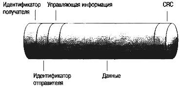

# Работа сети

Работа сети заключается в передаче данных от одного компьютера к другому. В этом процессе можно выделить несколько
отдельных задач:

- распознать данные;
- разбить данные на управляемые блоки;
- добавить информацию к каждому блоку, чтобы:
- указать местонахождение данных;
- указать получателя;
- добавить информацию синхронизации и информацию для проверки ошибок;
- поместить данные в сеть и отправить их по заданному адресу.
-

Сетевая операционная система при выполнении всех задач следует строгому на бору процедур. Эти процедуры называются
протоколами или правилами поведения. Протоколы регламентируют каждую сетевую операцию.

Стандартные протоколы позволяют программному и аппаратному обеспечению различных производителей нормально
взаимодействовать. Существует стандартов - модель OSI.

## Модель OSI

В 1978 году International Standards Organization (ISO) выпустила набор спецификаций, описывающих архитектуру сети с
неоднородными устройствами. Исходный документ относился к открытым системам, чтобы все они могли использовать одинаковые
протоколы и стандарты для обмена информацией.

В 1984 году ISO выпустила новую версию своей модели, названную эталонной моделью взаимодействия открытых систем (Open
System Interconnection reference model, OSI). Версия 1984 года стала международным стандартом: ее спецификации
используют производители при разработке сетевых продуктов, она лежит в основе построения различных сетей.

Эта модель — широко распространенный метод описания сетевых сред. Являясь многоуровневой системой, она отражает
взаимодействие программного и аппаратного обеспечения при осуществлении сеанса связи, а также помогает решить
разнообразные проблемы.

### Многоуровневая архитектура

В модели OSI сетевые функции распределены между семью уровнями. Каждому уровню соответствуют различные сетевые
операции, оборудование и протоколы.

На рис. представлена многоуровневая архитектура модели OSI.

На каждом уровне выполняются определенные сетевые функции, которые взаимодействуют с функциями соседних уровней,
вышележащего и нижележащего. Например, Сеансовый уровень должен
взаимодействовать только с Представительским и Транспортным уровнем и т.п. Все эти функции подробно описаны.

Нижние уровни — 1-й и 2-й — определяют физическую среду передачи данных и сопутствующие задачи (такие, как передача
битов данных через плату сетевого адаптера и кабель). Самые верхние уровни определяют, каким способом осуществляется
доступ приложений к услугам связи. Чем выше уровень, тем более сложную задачу он решает.

Каждый уровень предоставляет несколько услуг (т.е. выполняет несколько операций), подготавливающих данные для доставки
по сети на другой компьютер. Уровни отделяются друг от друга границами — интерфейсами. Все запросы от одного уровня к
другому передаются через интерфейс. Каждый уровень использует услуги нижележащего уровня.

### Взаимодействие уровней модели OSI

Задача каждого уровня — предоставление услуг вышележащему уровню, «маскируя» детали реализации этих услуг. При этом
каждый уровень на компьютере-отправителе работает так, будто он напрямую связан с таким же уровнем на
компьютере-получателе. Эта логическая, или виртуальная, связь между одинаковыми уровнями показана на рисунке.

Однако в действительности связь осуществляется между смежными уровнями одного компьютера — программное обеспечение,
работающее на каждом уровне, реализует определенные сетевые функции в соответствии с набором протоколов.
Перед подачей в сеть данные разбиваются на пакеты. Пакет (packet) — это единица информации, передаваемая между
устройствами сети как единое целое. Пакет проходит последовательно через все уровни программного обеспечения. На каждом
уровне к пакету добавляется некоторая информация, форматирующая или адресная, которая необходима для успешной передачи
данных по сети.

На принимающей стороне пакет проходит через все уровни в обратном порядке. Программное обеспечение на каждом уровне
читает информацию пакета, затем удаля ет информацию, добавленную к пакету на этом же уровне отправляющей стороной, и
передает пакет следующему уровню. Когда пакет дойдет до Прикладного уровня, вся адресная информация будет удалена и
данные примут свой первоначальный вид.

Таким образом, за исключением самого нижнего уровня сетевой модели, никакой иной уровень не может непосредственно
послать информацию соответствующему уровню другого компьютера. Информация на компьютере-отправителе должна пройти через
все уровни. Затем она передается по сетевому кабелю на компьютер-получатель и опять проходит сквозь все слои, пока не
достигнет того же уровня, с которого она была послана на компьютере-отправителе.

Например, если Сетевой уровень передает
информацию с компьютера А, она спускается через Канальный и Физический уровни в сетевой кабель, далее по нему попадает в
компьютер В, где поднимается через Физический и Канальный уровни и достигает Сетевого уровня.

Примером информации, переданной Сетевым уровнем компьютера А Сетевому уровню компьютера В, мог бы служить адрес и,
очевидно, информация контроля ошибок, добавленные к пакету.

Взаимодействие смежных уровней осуществляется через интерфейс. Интерфейс определяет услуги, которые нижний уровень
предоставляет верхнему, и способ доступа к ним. Каждому уровню одного компьютера «кажется», что он непосредственно
взаимодействует с таким же уровнем другого компьютера.

Далее описывается каждый из семи уровней модели OSI и определяются услуги, которые они предоставляют смежным уровням.

#### Прикладной уровень

Уровень 7, Прикладной (Application), — самый верхний уровень модели OSI. Он пред ставляет собой окно для доступа
прикладных процессов к сетевым услугам. Этот уро вень обеспечивает услуги, напрямую поддерживающие приложения
пользователя, та кие, как программное обеспечение для передачи файлов, доступа к базам данных и электронная почта.
Нижележащие уровни поддерживают задачи, выполняемые на Прикладном уровне. Прикладной уровень управляет общим доступом к
сети, потоком данных и восстановлением после сбоев связи.

#### Представительский уровень

Уровень 6, Представительский (Presentation), определяет формат, используемый для обмена данными между сетевыми
компьютерами. Этот уровень можно назвать переводчиком. На Представительском уровне компьютера-отправителя данные,
поступив шие от Прикладного уровня, переводятся в общепонятный промежуточный формат.

На этом же уровне компьютера-получателя происходит обратный перевод: из промежуточного формата в тот, который
используется Прикладным уровнем данного компьютера. Представительский уровень отвечает за преобразование протоколов,
трансляцию данных, их шифрование, смену или преобразование применяемого набора символов (кодовой таблицы) и расширение
графических команд. Представительский уровень, кроме того, управляет сжатием данных для уменьшения общего числа
передаваемых битов.

На этом уровне работает утилита, называемая редиректором (redirector). Ее назначение — перенаправлять локальные
операции ввода/вывода на сетевой сервер.

#### Сеансовый уровень

Уровень 5, Сеансовый (Session), позволяет двум приложениям на разных компьютерах устанавливать, использовать и завершать
соединение, называемое сеансом. На этом уровне выполняются такие функции, как распознавание имен и защита, необходимые
для связи двух приложений в сети.

Сеансовый уровень обеспечивает синхронизацию между пользовательскими задачами посредством расстановки в потоке данных
контрольных точек (checkpoints). Та ким образом, в случае ошибки потребуется заново передать только данные, следующие за
последней контрольной точкой. Этот уровень управляет диалогом между взаимодействующими процессами, т.е. регулирует,
какая из сторон когда, как долго и т.д. должна осуществлять передачу.

#### Транспортный уровень

Уровень 4, Транспортный (Transport), располагается ниже Сеансового уровня. Транспортный уровень гарантирует доставку
пакетов без ошибок, в той же последовательно сти, без потерь и дублирования. На этом уровне компьютера-отправителя
сообщения переупаковываются: длинные разбиваются на несколько пакетов, а короткие объединяются в один. Это увеличивает
эффективность передачи пакетов по сети. На Транс портном уровне компьютера-получателя сообщения распаковываются,
восстанавливаются в первоначальном виде, и обычно посылается сигнал подтверждения приема.

Транспортный уровень управляет потоком сообщений, проверяет ошибки и участвует в решении проблем, связанных с отправкой
и получением пакетов.

#### Сетевой уровень

Уровень 3, Сетевой (Network), отвечает за адресацию сообщений и перевод логических адресов и имен в физические адреса.
Одним словом, исходя из конкретных сетевых условий, приоритета услуги и других факторов здесь определяется маршрут от
компьютера-отправителя к компьютеру-получателю. На этом уровне решаются также такие задачи и проблемы, связанные с
сетевым графиком, как коммутация пакетов, маршрутизация и перегрузки.

Если сетевой адаптер маршрутизатора не может передавать большие блоки дан ных, посланные компьютером-отправителем, на
Сетевом уровне эти блоки разбиваются на меньшие. А Сетевой уровень компьютера-получателя собирает эти данные в исходное
состояние.

#### Канальный уровень

Уровень 2, Канальный (Data Link), осуществляет передачу кадров (frames) данных от Сетевого уровня к Физическому. Кадры —
это логически организованная структура, в которую можно помещать данные. Канальный уровень компьютера-получателя
упаковывает «сырой» поток битов, поступающих от Физического уровня, в кадры данных.
На рис. представлен простой кадр данных, где идентификатор отправителя — адрес компьютера-отправителя, а
идентификатор получателя — адрес компьютера-получателя. 

Управляющая информация используется для маршрутизации, а также
указывает на тип пакета и сегментацию. Данные — собственно передаваемая информа ция. CRC (остаток избыточной
циклической суммы) — это сведения, которые помогут выявить ошибки, что, в свою очередь, гарантирует правильный прием
информации.

Рис. 3.3. Кадр данных

Канальный уровень обеспечивает точность передачи кадров между компьютерами через Физический уровень. Это позволяет
Сетевому уровню считать передачу данных по сетевому соединению фактически безошибочной.

Обычно, когда Канальный уровень посылает кадр, он ожидает со стороны получателя подтверждения приема. Канальный уровень
получателя проверяет наличие возможных ошибок передачи. Кадры, поврежденные при передаче или не получившие
подтверждения о приеме, посылаются заново.

#### Физический уровень

Уровень 1, Физический (Physical), — самый нижний в модели OSI. Этот уровень осуществляет передачу неструктурированного,
«сырого», потока битов по физической среде (например, по сетевому кабелю). Здесь реализуются электрический, оптический,
механический и функциональный интерфейсы с кабелем. Физический уровень также формирует сигналы, которые переносят
данные, поступившие от всех вышележащих уровней.

На этом уровне определяется способ соединения сетевого кабеля с платой сетевого адаптера, в частности, количество
контактов в разъемах и их функции. Кроме того, здесь определяется способ передачи сигналов по сетевому кабелю.
Физический уровень предназначен для передачи битов (нулей и единиц) от одно го компьютера к другому. Содержание самих
битов на данном уровне значения не имеет. Этот уровень отвечает за кодирование данных и синхронизацию битов, гаран
тируя, что переданная единица будет воспринята именно как единица, а не как ноль. Наконец, Физический уровень
устанавливает длительность каждого бита и способ перевода бита в соответствующие электрические или оптические импульсы,
передаваемые по сетевому кабелю.